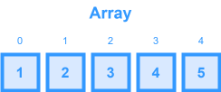
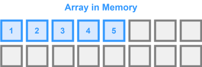

# Array & String

An `array` is a _contiguous_ area of memory consisting of equal-size elements indexed by _contiguous_ integers.  

It provides quick (constant-time) random access to any element using its index. Most modern programming languages (including JavaScript/TypeScript) offer dynamic array implementations that can grow or shrink as needed. However, under the hood, these are usually implemented as a dynamic array (e.g., `std::vector` in C++ or `ArrayList` in Java) that may need to resize and copy elements occasionally.

> The term "contiguous" here means that elements are stored one after the other (1,2,3). This means that each element of an array holds space in memory directly adjacent to the element that came before it.

The key point about arrays is that we have constant-time access to read & write elements.

### Key Characteristics

- **Contiguous Memory:** Items are stored next to each other, which improves cache locality and speeds up element access.
- **Fixed or Dynamic Size:** Classic arrays have a fixed size, but dynamic arrays allow resizing.
- **Index-Based Access:** Elements can be directly accessed via their integer index (zero-based in most languages).
- **Homogeneous Elements:** Typically, arrays are seen as collections of elements of the same type (though in JavaScript/TypeScript arrays, mixed types are allowed).

### Reading from an Array

To read from an array, you just need to take the address of the array, add the element size and multiply by $i$ (which is the index of interest) minus the first index.

$array_addr + elem_size \times (i - first_index)$

So, for example, if you have an array $[1,2,3,4,5]$ and you want to get the address of the 4th array element, you would get the following equation:

$fourth_element = array_addr + elem_size \times (4 - 1)$

___

## Time/Space Complexity

### Time Complexity
- **Read**: $O(1)$
- **Update**: $O(1)$
- **Insert**: $O(n)$
- **Delete**: $O(n)$
- **Search**: $O(n)$
- **Search** (sorted): $O(\log(n))$

### Space Complexity

For an array containing $n$ elements, the overall space used is $O(n)$. In dynamic arrays, additional space may be allocated to minimize the cost of frequent resizing (e.g., doubling the capacity), but this extra space remains $O(n)$.
___

## Edge Cases

### Empty Array

Always check if the array is empty before performing operations like accessing the first element or processing elements.

### Index Out-of-Bounds

Validate that the index is within range (`0` to `length - 1`) to avoid runtime errors.

### Full Capacity (for static arrays)

If using fixed-size arrays, ensure that you do not exceed the allocated space.

### Resize Overhead in Dynamic Arrays

In dynamic arrays, the resizing operation (which might involve copying all elements into a new, larger array) could temporarily slow down the insert operation.

### Immutable Elements

In some languages or frameworks, arrays might be immutable. In such cases, operations like insertion or deletion return new arrays rather than modifying the existing one.
___

## When to Use Arrays

There are several reasons for using arrays as a data structure in an algorithm:
* Arrays are best for storing multiple values in a single variable
* Arrays are better at processing many values easily and quickly
* Sorting and searching the values is simple

### Random Access is Required

When you need constant-time access to elements based on index.

### Iterative Processing

Traversing the list of elements where order matters.

### Storing Ordered Data

When the data is expected to remain in a specific sequence (such as in time series or sorted collections).

### Foundational Building Block

Arrays often serve as the basis for implementing other data structures (e.g., heaps, stacks, queues) or algorithms (e.g., sorting, searching).

### Sliding Window Problems

Many interview questions involving substrings, subarrays, or ranges are efficiently managed using arrays.

### Data Manipulation Problems

Examples include “Two Sum,” “Merge Sorted Array,” “Remove Duplicates from Sorted Array,” etc.

### Precomputation

For questions where summation or multiplication of a subarray is involved, pre-computation using hashing or a prefix/suffix sum/product might be useful.
___

## Strings

A string is just an array of characters. For example "Apple" can be characterized as `[A, p, p, l, e]`. Most questions that deal with arrays can also be done with strings and vise versa.

### Context Questions for Strings
* When a problem includes a string input, be sure to ask if it is known whether the string is ASCII or Unicode. If it's ASCII, you'll know that the max number of unique characters is either 128 (usually) or 256 (ASCII extended).

If a question has any constraints that guarantee that input strings will only have uppercase or lowercase English letters, you can use an `array` to store all possible characters from `A` to `z`. This is faster than using a `hash table` in most cases.
* **Uppercase Only** - Build an array of $26$ elements set at $0$. Use the character char code and offset it by $65$ which is the char code for `A`.
* **Lowercase Only** - Build an array of $26$ elements set at $0$. Use the character char code and offset it by $97$ which is the char code for `a`.
* **Uppercase & Lowercase Only** - Build an array of $58$ elements set at $0$. Use the character char code and offset it by $65$ which is the char code for `A` and would be the start of the subset of `A` to `z`.

### ASCII Table

| Code | Symbol |
|------|--------|
| 65   | A      |
| 90   | Z      |
| 97   | a      |
| 122  | z      |

> **NOTE:** While this method does provide efficiency in _space_ it may not be the most efficient in terms of _time_. There is overhead to `.charAt()` calls on strings to get the ASCII code of each character. If doing a significant amount of iteration, it may make more sense to use a Hash Table or Hash Set, despite the added memory.
___

## LeetCode Questions

- **Two Sum**
    - **Overview:** Find two numbers such that they add up to a specific target.
    - **Note:** Often requires the use of a hash map for optimal performance.

- **Best Time to Buy and Sell Stock**
    - **Overview:** Determine the maximum profit from buying and selling stock given an array of prices.
    - **Note:** A fundamental array-traversal problem with a focus on maintaining optimal state.

- **Contains Duplicate**
    - **Overview:** Check if any value appears at least twice in the array.
    - **Note:** Can be solved using a hash set for efficiency, so some familiarity with hash maps is beneficial.

- **Merge Sorted Array**
    - **Overview:** Merge two sorted arrays into one sorted array.
    - **Note:** Focuses on array manipulation and two-pointer techniques.

- **Remove Duplicates from Sorted Array**
    - **Overview:** Modify a sorted array in-place such that duplicates are removed.
    - **Note:** Reinforces in-place array modification and the two-pointer method.

- **Product of Array Except Self**
    - **Overview:** Given an array, construct a new array such that each element at index $i$ is the product of all the numbers in the original array except the one at $i$.
    - **Note:** Involves multiple passes through the array and careful handling of edge cases.

- **Find Minimum in Rotated Sorted Array**
    - **Overview:** Use binary search on a rotated sorted array to find its minimum element.
    - **Note:** Requires combining knowledge of arrays with the binary search algorithm.

> **NOTE:** Some of these problems mix array fundamentals with other concepts (like hash maps, two-pointers, or binary search), so ensure you have a solid understanding of those supporting techniques as well.