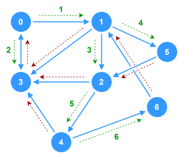
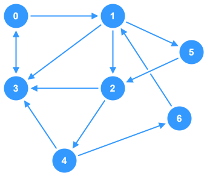

# Breadth-First Search (Iterative) - Graphs



This is a simple example of an iterative **Breadth-First Search** (BFS) implementation done on a **directed**, **unweighted**, **cyclic** graph. The BFS function exists as a member function of the `Graph` class and logs each node to the console as it's visited in the traversal.

## Breakdown

1. **Visited Nodes List**
    - Initialize a variable to track nodes that have already been visited in the traversal to avoid infinite loops
2. **Queue Data Structure**
    - Initialize a `queue` data structure to handle the processing of the traversal loop.
    - Begin by adding the starting node to the **end** of the `queue`.
3. **Traversal Loop**
    - Create a while loop to run as long as the traversal `queue` is **not empty**.
    - **Inside the Loop**:
        - `dequeue` a `node` from the traversal `queue`
        - Check if the `node` has already been visited -- skip processing if `true`
        - Mark the `node` as "visited"
        - Process the `node` (log it to the console)
        - Find all nodes that are in the adjacency list for `node` and `enqueue` each one that hasn't been visited yet.
4. **Termination**
    - Once the `queue` is empty, the traversal is complete.


## TypeScript Implementation

This implementation uses a **directed**, **unweighted**, **cyclic** graph as the subject of traversal.



The BFS function is a member of the `Graph` class and takes a starting node as a parameter. For the purposes of this implementation, "processing" a node simply means to log it to the console.

```ts
class Graph {
  private adjacencyList: Record<number, Set<number>>;

  constructor(initial: Record<number, Set<number>> = {}) {
    this.adjacencyList = initial;
  }

  /**
   * Performs Breadth-First Search traversal on the graph starting 
   * at the given `start` node. Each node is processed by logging 
   * it's value to the console.
   * @param start Starting node of the traversal
   */
  public bfs(start: number): void {
    // Only proceed if start exists in the graph
    if (!(start in this.adjacencyList)) return;
    // Set to track nodes that have been visited
    const visited: Set<number> = new Set();
    // Intialize Queue
    const queue: number[] = [];
    // Begin by adding the starting node to the end of the queue
    queue.push(start);
    // Iterate through queue as long as it has items
    while (queue.length > 0) {
      // Dequeue a node from the front of the queue
      const node = queue.shift();
      // Skip if the node has already been visited
      if (visited.has(node)) continue;
      // Mark the node as visited
      visited.add(node);
      // Process the node
      console.log(node);
      // Add all unvisited neighboring nodes onto the back of the queue
      for (const neighbor of this.adjacencyList[node]) {
        if (!visited.has(neighbor)) {
          queue.push(neighbor);
        }
      }
    }
  }

}

const graph = new Graph(
  {
    0: new Set([1, 3]),
    1: new Set([2, 3, 5]),
    2: new Set([3, 4]),
    3: new Set([0]),
    4: new Set([3, 6]),
    5: new Set([2]),
    6: new Set([1]),
  }
);

graph.bfs(0);

// Output:
// 0
// 1
// 3
// 2
// 5
// 4
// 6
```