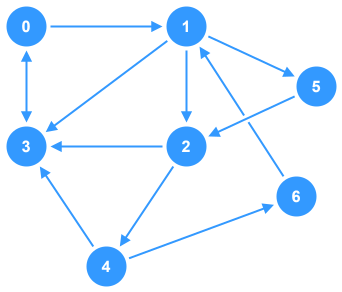

# Depth-First Search (Iterative) - Graphs


This is a basic example of an _iterative_ implementation of **Depth-First Search** (DFS) on a **directed**, **unweighted**, **cyclic** graph. The DFS function exists as a member function of the `Graph` class and logs each node to the console as it's visited in the traversal.

## Breakdown

1. **Visited Nodes List**
    - Initialize a variable to track nodes that have already been visited in the traversal to avoid infinite loops
2. **Stack Data Structure**
    - Initialize a `stack` data structure to handle the processing of the traversal loop.
    - Begin by pushing the starting node onto the `stack`.
3. **Traversal Loop**
    - Create a while loop to run as long as the traversal `stack` is **not empty**.
    - **Inside the Loop**:
      - Remove a `node` from the **top** of the `stack`.
      - Check if the `node` has already been visited -- skip processing if `true`
      - Mark the `node` as "visited"
      - Process the `node` (log it to the console)
      - Find all nodes that are in the adjacency list for `node` and push each one on the `stack` if it hasn't been visited
4. **Termination**
    - Once the `stack` is empty, the traversal is complete.

## TypeScript Implementation

This implementation uses a **directed**, **unweighted**, **cyclic** graph as the subject of traversal.



The DFS function is a member of the `Graph` class and takes a starting node as a parameter. For the purposes of this implementation, "processing" a node simply means to log it to the console.

```ts
class Graph {
  private adjacencyList: Record<number, Set<number>>;

  constructor(initial: Record<number, Set<number>> = {}) {
    this.adjacencyList = initial;
  }

  /**
   * Pefroms Depth-First Search traversal on the graph starting 
   * at the given `start` node. Each node is processed by logging 
   * it to the console.
   * @param start Starting node of the traversal
   */
  public dfs(start: number): void {
    // First, make sure the start node exists in the graph
    if (!(start in this.adjacencyList)) return;

    // Set to track nodes that have been visited
    const visited: Set<number> = new Set();
    // Stack to process traversal loop
    const stack: number[] = [];
    // Begin by pushing the starting node onto the stack
    stack.push(start);

    // Traversal loop
    while (stack.length > 0) {
      // Pop a node off the top of the stack
      const node = stack.pop();
      // Check if the node has been visited
      if (visited.has(node)) continue;
      // Add the node to the "visited" set
      visited.add(node);
      // Process the node
      console.log(node);
      // Push unvisited neighbor nodes to the traversal stack
      for (const neighbor of this.adjacencyList[node]) {
        // Only add the node to the stack if it hasn't been visited
        if (!visited.has(neighbor)) {
          stack.push(neighbor);
        }
      }
    }
  }
}

const graph = new Graph(
  {
    0: new Set([3, 1]),
    1: new Set([5, 3, 2]),
    2: new Set([4, 3]),
    3: new Set([0]),
    4: new Set([6, 3]),
    5: new Set([2]),
    6: new Set([1]),
  }
);

graph.dfs(0);

// Output:
// 0
// 1
// 2
// 3
// 4
// 6
// 5
```