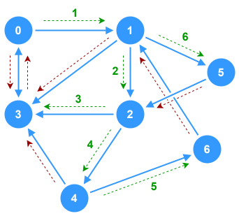

# Depth-First Search (Recursive) - Graphs



This is a basic example of a _recursive_ implementation of **Depth-First Search** (DFS) on a **directed**, **unweighted**, **cyclic** graph. The DFS function exists as a member function of the `Graph` class and logs each node to the console as it's visited in the traversal.

## Breakdown

1. **Visited Nodes List**
   - Initialize a variable to track nodes that have already been visited in the traversal to avoid infinite loops
2. **Recursive DFS Function**
   - Create a nested, recursive function within the DFS function to handle the actual traversal
   - **Parameters**: 
     - `node` : `number` - The current node being processed
   - **Functionality**:
     - Mark the `node` as visited by adding it to the visited nodes list
     - Process the `node` (log it to the console)
     - Find all nodes that are in the adjacency list for `node` and call the recursive function on each adjacent node that hasn't already been visited
3. **Base Call**
   - Create a base call of the recursive function on the starting node to begin the process.

## TypeScript Implementation

This implementation uses a **directed**, **unweighted**, **cyclic** graph as the subject of traversal. 


The DFS function is a member of the `Graph` class and takes a starting node as a parameter. For the purposes of this implementation, "processing" a node simply means to log it to the console.

```ts
class Graph {
  private adjacencyList: Record<number, Set<number>>;
  
  constructor(initial: Record<number, Set<number>> = {}) {
    this.adjacencyList = initial;
  }

  public addVertex(data: number): void {}

  public addEdge(from: number, to: number): void {
    if (from === to) return;
    if (!(from in this.adjacencyList)) this.adjacencyList[from] = new Set();
    if (!(to in this.adjacencyList)) this.adjacencyList[to] = new Set();

    if (!this.adjacencyList[from]!.has(to)) {
      this.adjacencyList[from].add(to);
    }
  }

   /**
    * Pefroms Depth-First Search traversal on the graph starting
    * at the given `start` node. Each node is processed by logging
    * it to the console.
    * @param start Starting node of the traversal
    */
   public dfs(start: number): void {
      // First, make sure the start node exists in the graph
      if (!(start in this.adjacencyList)) return;
     
      // Set to track nodes that have been visited
      const visited: Set<number> = new Set();

      /**
       * Recursive helper function
       * @param node The current node being visited
       */
      const dfsHelper = (node: number) => {
         // Add the current node to the visited list
         visited.add(node);
         // Process the node
         console.log(node);
         // Iterate over all the adjacent nodes
         for (const neighbor of this.adjacencyList[node]) {
            // Call dfsHelper on any unvisited nodes
            if (!visited.has(neighbor)) {
               dfsHelper(neighbor);
            }
         }
      }

      // Base call
      dfsHelper(start);
   }
}

const graph = new Graph(
  {
    0: new Set([1, 3]),
    1: new Set([2, 3, 5]),
    2: new Set([3, 4]),
    3: new Set([0]),
    4: new Set([3, 6]),
    5: new Set([2]),
    6: new Set([1]),
  }
);

graph.dfs(0);

// Output:
// 0
// 1
// 2
// 3
// 4
// 6
// 5
```