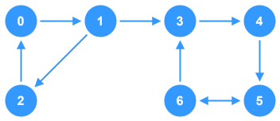

# Directed, Unweighted, Cyclic Graph



This is a very basic implementation of a `graph` that is **directed**, **unweighted** and **cyclic**. The `vertices` of this graph store `integers` as their data.

## Breakdown
- **Adjacency List**: This graph uses an `adjacency list` to store `vertices` and `edges`.
- **Add Vertex**: Adds a new `vertex` to the graph with a given `number`.
    - The `vertex` is initialized without any connections
    - The function has checks to avoid duplicate data
- **Add Edge**: Adds a new **directed** `edge` going from node `A` to node `B`
    - If either provided `vertex` doesn't exist in the graph, it is created
    - Avoid duplicate connections
    - Avoid self-referencing connections (e.g.: `A -> A`)
- **Print Graph**: Debug method used to output the connections between `vertices` within the graph

## TypeScript Implementation

```ts
/**
 * Represents the adjacency list for a graph
 */
type GraphNodeList = { [data: number]: Set<number> }

/**
 * This is a very basic implementation of a graph that is 
 * directed, unweighted and cyclic. The vertices of this graph 
 * store integers as their data.
 */
class Graph {

  /**
   * Stores the connections between vertices in the graph
   */
  private adjacencyList: GraphNodeList;

  constructor() {
    this.adjacencyList = {};
  }

  /**
   * Adds a new vertex with the given `number` to the graph. If
   * a vertex already exists in the graph with the given
   * `number`, then nothing is done.
   * @param node The node data to add as a vertex
   */
  addVertex(data: number): void {
    if (!(data in this.adjacencyList)) {
      this.adjacencyList[data] = new Set();
    }
  }

  /**
   * Adds a directed connection from vertex `from` to vertex `to`. 
   * Prevents self-referencing and duplicates and adds any 
   * vertices that don't already exist.
   * @param from Starting vertex of the connection
   * @param to Ending vertex of the connection
   */
  addEdge(from: number, to: number): void {
    // Prevent self-referencing connection
    if (from === to) return;
    // Add missing vertices
    if (!(from in this.adjacencyList)) this.adjacencyList[from] = new Set();
    if (!(to in this.adjacencyList)) this.adjacencyList[to] = new Set();
    // Prevent duplicates
    if (!this.adjacencyList[from]!.has(to)) {
      this.adjacencyList[from]!.add(to);
    }
  }

  /**
   * Debug method used to output the connections between
   * vertices within the graph
   */
  printGraph(): void {
    for (const vertex in this.adjacencyList) {
      const connections = (Array.from(this.adjacencyList[vertex]).join(', '));
      console.log(`${vertex} -> ${connections}`);
    }
  }
}


const graph: Graph = new Graph();
graph.addVertex(0);
graph.addVertex(1);
graph.addVertex(2);
graph.addVertex(3);
graph.addVertex(4);
graph.addVertex(5);
graph.addVertex(6);

graph.addEdge(0, 1);
graph.addEdge(1, 2);
graph.addEdge(1, 3);
graph.addEdge(2, 0);
graph.addEdge(3, 4);
graph.addEdge(4, 5);
graph.addEdge(5, 6);
graph.addEdge(6, 3);
graph.addEdge(6, 5);

graph.printGraph();

// Answer:
// 0 -> 1
// 1 -> 2, 3
// 2 -> 0
// 3 -> 4
// 4 -> 5
// 5 -> 6 
// 6 -> 3, 5     

```