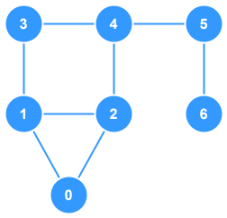

# Undirected, Unweighted, Cyclic Graph



This is a very basic implementation of a `graph` that is undirected, unweighted and cyclic. The `vertices` of this graph store `integers` as their data.


## Breakdown

- **Adjacency List**: This graph uses an `adjacency list` to store `vertices` and `edges`.
  - A `Record` data type is used instead of a `Map` here as it offers better runtime
- **Add Vertex**: Adds a new `vertex` to the graph with a given `number`.
  - The `vertex` is initialized without any connections
  - The function has checks to avoid duplicate data
- **Add Edge**: Adds a new `edge` between two `vertices` within the graph
  - If either provided `vertex` doesn't exist in the graph, it is created
  - Because the graph is `undirectecd` two `edges` must be added for every connection: `A -> B` and `B -> A`
- **Show Connections**: Debug method used to output the connections between `vertices` within the graph

## TypeScript Implementation

```ts
/**
 * This is a very basic implementation of a graph that is
 * undirected, unweighted and cyclic. The vertices of this graph
 * store integers as their data.
 */
class Graph {
  /**
   * Stores the connections between vertices in the graph
   */
  private adjacencyList: Record<number, Set<number>>;

  constructor() {
    this.adjacencyList = {};
  }

  /**
   * Adds a new vertex with the given `number` to the graph. If
   * a vertex already exists in the graph with the given
   * `number`, then nothing is done.
   * @param node The node data to add as a vertex
   */
  addVertex(node: number): void {
    // Check first if we already have this node
    if (node in this.adjacencyList) {
      // Do nothing if it already exists
      return;
    }
    this.adjacencyList[node] = new Set();
  }

  /**
   * Adds a new connection between the two given vertices. If
   * either of the vertices doesn't exist, it is created.
   * @param node1 Data representing the first vertex
   * @param node2 Data representing the second vertex
   */
  addEdge(node1: number, node2: number): void {
    // Create the first vertex if it doesn't exist
    if (!(node1 in this.adjacencyList)) this.adjacencyList[node1] = new Set();
    // Create the second vertex if it doesn't exist
    if (!(node2 in this.adjacencyList)) this.adjacencyList[node2] = new Set();
    // Add a new entry to the adjacency list connecting node1 >> node2
    this.adjacencyList[node1].add(node2);
    // Add a new entry to the adjacency list connecting node2 >> node1
    this.adjacencyList[node2].add(node1);
  }

  /**
   * Debug method used to output the connections between
   * vertices within the graph
   */
  showConnections(): void {
    // Iterate over every vertex in the adjacency list
    for (const vertex in this.adjacencyList) {
      // Get the connections for this vertex
      const connections = (Array.from(this.adjacencyList[vertex].keys()).join(", "));
      // Log the vertex and its connections
      console.log(`${vertex} -> ${connections}`);
    }
  }
}


const myGraph = new Graph();
myGraph.addVertex(0);
myGraph.addVertex(1);
myGraph.addVertex(2);
myGraph.addVertex(3);
myGraph.addVertex(4);
myGraph.addVertex(5);
myGraph.addVertex(6);
myGraph.addEdge(3, 1);
myGraph.addEdge(3, 4);
myGraph.addEdge(3, 4);
myGraph.addEdge(4, 2);
myGraph.addEdge(4, 5);
myGraph.addEdge(1, 2);
myGraph.addEdge(1, 0);
myGraph.addEdge(0, 2);
myGraph.addEdge(6, 5);

myGraph.showConnections();

// Answer:
// 0 -> 1, 2
// 1 -> 3, 2, 0
// 2 -> 4, 1, 0
// 3 -> 1, 4   
// 4 -> 3, 2, 5
// 5 -> 4, 6   
// 6 -> 5  
```