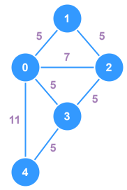

# Undirected, Weighted, Cyclic Graph



This is a very basic implementation of a `graph` that is **undirected**, **weighted** and **cyclic**. The `vertices` of this graph store `integers` as their data.

## Breakdown
- **Adjacency List**: This graph uses an `adjacency list` to store `vertices` and their **weighted** connections
- **Add Vertex**: Adds a new `vertex` to the graph with a given `number`.
    - The `vertex` is initialized without any connections
    - The function has checks to avoid duplicate data
- **Add Edge**: Adds a new **undirected** `edge` going from node `A` to node `B` with a weight of `W`
    - If either provided `vertex` doesn't exist in the graph, it is created
    - Avoid self-referencing connections (e.g.: `A -> A`)
    - Weights must be `integers` greater than `0`
- **Print Graph**: Debug method used to output the weighted connections between `vertices` within the graph

## TypeScript Implementation

```ts
/**
 * Represents the weighted adjacency list for a graph
 */
type GraphAdjacencyList = {[vertex: number]: Record<number,number>}

class Graph {
  private adjacencyList: GraphAdjacencyList;

  constructor() {
    this.adjacencyList = {};
  }

  addVertex(data: number): void {
    if (!(data in this.adjacencyList)) {
      this.adjacencyList[data] = {};
    }
  }

  addEdge(a: number, b: number, weight: number): void {
    // Avoid self-references & invalid weights
    if (a === b || weight < 0) return;
    // Add missing vertices
    if (!(a in this.adjacencyList)) this.adjacencyList[a] = {};
    if (!(b in this.adjacencyList)) this.adjacencyList[b] = {};
    // If edges exist, their weights will be updated
    this.adjacencyList[a][b] = weight;
    // Undirected, so add edge from the other direction
    this.adjacencyList[b][a] = weight;
  }

  printGraph(): void {
    for (const vertex in this.adjacencyList) {
      let edges: string[] = [];
      for (const edge in this.adjacencyList[vertex]) {
        edges.push(`(${edge}:${this.adjacencyList[vertex][edge]})`);
      }
      console.log(`${vertex} -> ${edges.join(', ')}`);
    }
  }
}


const graph = new Graph();

graph.addVertex(0);
graph.addVertex(1);
graph.addVertex(2);
graph.addVertex(3);
graph.addVertex(4);

graph.addEdge(0, 1, 5);
graph.addEdge(0, 2, 7);
graph.addEdge(0, 3, 5);
graph.addEdge(0, 4, 11);
graph.addEdge(1, 2, 5);
graph.addEdge(2, 3, 5);
graph.addEdge(3, 4, 5);

graph.printGraph();

// Answer
// 0 -> (1:5), (2:7), (3:5), (4:11)
// 1 -> (0:5), (2:5)
// 2 -> (0:7), (1:5), (3:5)
// 3 -> (0:5), (2:5), (4:5)
// 4 -> (0:11), (3:5)
```