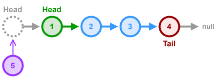
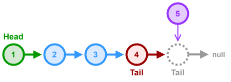
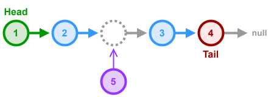

# Linked List - Insert Node Implementations

Insertion of a new node into a `LinkedList` is fairly simple. The most common functions for doing this will insert a node at the `head`, `tail` or `kth` position of the `LinkedList`.

* **Dependencies**:
    * [Linked List - Singly Linked - Node.md](Linked%20List%20-%20Singly%20Linked%20-%20Node.md) - The generic node class for the `LinkedList`

---

## Insert Node at Head



### Breakdown
Inserting a new node at the head of a `LinkedList` is very easy. You just need to create the node and have it's `next` pointer reference the old `head` node of the `LinkedList`. When not using a `LinkedList` wrapper class, it's important to return the newly created node as it is now the new `head` of the list.

### TypeScript Implementation

**Complexity**
- **Time**: $O(1)$
- **Space**: $O(1)$ extra, aside from the one new node.

```ts
import { ListNode } from "./dsa/linked-lists/singly-linked-list";
class LinkedListNode extends ListNode<number> {}

/**
 * Creates a new LinkedListNode instance with the given `value`, 
 * prepends it to the Linked List and returns it as the new head 
 * of the list.
 * @param head The current head node of the linked list
 * @param value Value of the new linked list node
 * @returns The new head node of the linked list
 */
function insertAtHead(head: LinkedListNode, value: number): LinkedListNode {
  // Return a newly created LinkedListNode pointing to the old head
  return new LinkedListNode(value, head);
}
```

---

## Insert Node at Tail



### Breakdown
This is an iterative implementation of a function that inserts a new node at the end (tail) of a singly linked list. If the list is empty, the new node becomes the head.

1. **Node Creation**
    - Instantiate a new `LinkedListNode` with the provided `value`.
2. **Empty List Check**
    - If `head` is `null`, return `newNode` immediately—there’s no traversal needed.
3. **Traverse to Tail**
    - Initialize a `tail` pointer to `head`.
    - While `tail.next !== null`, advance: `tail = tail.next`.
4. **Attach New Node**
    - Now at the true tail (`tail.next === null`), set `tail.next = newNode`.
5. **Return Head**
    - Return the original `head` node so the list remains accessible from its start.

### TypeScript Implementation

**Complexity**
- **Time**: $O(n)$, where $n$ is the number of nodes (must traverse to the tail).
- **Space**: $O(1)$ extra, aside from the one new node.

**Edge Cases**
- `head === null`: yields a single-node list.
- Single-node list: the loop is skipped and the new node attaches directly.
- No circular-list handling is necessary for this simple singly linked structure.

```ts
import { ListNode } from "./dsa/linked-lists/singly-linked-list";
class LinkedListNode extends ListNode<number> {}

/**
 * Inserts a new LinkedListNode with the given `value` as the
 * new tail node of the Linked List and returns the current
 * head node of the linked list.
 * @param head The current head node of the Linked List
 * @param value The value to be inserted
 * @returns The current head node of the Linked List
 */
function insertAtTail(head: LinkedListNode | null, value: number): LinkedListNode {
  // Create the new node
  const newNode = new LinkedListNode(value);
  // If the head is null, just return the created node 
  // since it's the only node in the list.
  if (head === null) return newNode;
  // Iterate through the linked list until the tail is found
  let tail = head;
  while (tail.next !== null) {
    // Update the tail pointer to the next node in the list
    tail = tail.next;
  }
  // At this point, we should have the current tail node, 
  // now we just need to insert the new node at the end.
  tail.next = newNode;
  // Return the current head node
  return head;
}
```

---

## Insert Node at Kth Position



### Breakdown
This function creates a new node and inserts it within the Linked List at a specific position.

1. **Empty-List Check**
    - If `head` is `null`, construct and return a new node containing `value`.
2. **Invalid Position**
    - If `position` is negative, do nothing and return the original `head`.
3. **Insert at Beginning**
    - If `position === 0`, build a new node whose `next` pointer is the old head, then return this new node.
4. **Initialize Walk**
    - Set `prev = head` and `index = 0`.
5. **Traverse to Target**
    - While `prev` is not `null` and `index < position`:  
      a. Increment `index`.  
      b. If `index === position`,
        - Create a new node whose `next` is `prev.next`.
        - Hook `prev.next` to this new node.
        - Return the original `head`.  
          c. Otherwise, move `prev` to `prev.next`.
6. **Position Too Large**
    - If you exit the loop without inserting, return the original `head` unchanged.

### TypeScript Implementation

**Complexity**
- **Time**: $O(n)$, where $n$ is the number of nodes.
- **Space**: $O(1)$ extra, aside from the one new node.

```ts
import { ListNode } from "./dsa/linked-lists/singly-linked-list";
class LinkedListNode extends ListNode<number> {}

/**
 * Inserts a new LinkedListNode with the given `value` at
 * the given `position` within the Linked List. Returns the
 * head node of the Linked List.
 * @param head The head of the Linked List
 * @param value The value to be inserted into the list
 * @param position The 0-indexed position to insert the new node at
 * @returns The current head node of the Linked List
 */
function insertAtPosition(head: LinkedListNode | null, value: number, position: number): LinkedListNode {
  // If the list is empty, return the new node as the only node in the list
  if (head === null) {
    return new LinkedListNode(value);
  }
  
  // If the position is less than 0, do nothing. There's no need 
  // to check if the position is greater than the list size 
  // because the while loop will handle that automatically.
  if (position < 0) return head;
  
  // Handle case where we are inserting as new head
  if (position === 0) {
    return new LinkedListNode(value, head);
  }
  
  // Create a counter to determine the current position 
  // within the list.
  let index = 0;
  // Create pointer to previous node in list
  let prev = head;
  
  // Iterate through the Linked List nodes until either we've 
  // reached the target position, or we've reached the end of 
  // the list.
  while (index < position && prev !== null) {
    // First, increment the index
    index++;
    
    // Check if we've reached the target position
    if (index === position) {
      // Create the new node & pass the next pointer
      const newNode = new LinkedListNode(value, prev.next);
      // Update the next pointer of the previous node
      prev.next = newNode;
      // Return the head node
      return head;
    }
    
    // Update the prev pointer
    prev = prev.next;
  }
  
  // If we got to this point, then the position was out of 
  // bounds, so we do nothing and just return the head node.
  return head;
}
```