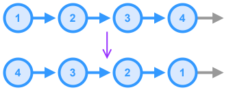

# Linked List - Reverse List



## Breakdown
This function reverses a `Singly Linked List` in place so that the `tail` becomes the new `head` and the `next` pointer of every node in the list now points to that node's **previous** node.

## TypeScript Implementation

### Dependencies
* [Linked List - Singly Linked - Node.md](Linked%20List%20-%20Singly%20Linked%20-%20Node.md) - The generic node class for the `LinkedList`

### Edge Cases
* Empty List
* List with One Node

### Complexity
* **Time**: $O(n)$ - every node in the list must be visited
* **Space**: $O(1)$ - in-place pointer manipulation

```ts
import { ListNode } from "./dsa/linked-lists/singly-linked-list";
class LinkedListNode extends ListNode<number> { }

/**
 * Reverses the linked list represented by the given
 * `head` node in-place such that, each node in the
 * list is pointing to the node that originally came
 * before it. The new head (originally the tail) is
 * returned.
 * @param head The current head node of the list
 * @returns The new head node of the list
 */
function reverse(head: LinkedListNode | null): LinkedListNode | null {
  // Create pointer to the current node
  let prev = null;
  let current = head;
  // Iterate through the nodes and reverse the pointers
  while (current !== null) {
    // Store reference to the next node
    const next = current.next;
    // Make the current node to point at previous node
    current.next = prev;
    // Update the pointers
    prev = current;
    current = next;
  }
  // At this point, `prev` points to the old tail/new head
  return prev;
}
```