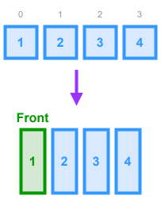

# Queue - Array Implementation



> **NOTE**: In TypeScript, it isn't really necessary to implement a custom `Queue` class for an array-based implementation, because the functionality is already built into arrays. This implementation is just for demonstration. In actual practice/interviews, you should use the built-in array functions to save yourself time.

## Breakdown

1. **Internal Storage**
    - Maintain a private array to hold the queued items.

2. **enqueue(item)**
    - Add the new `item` to the *back* of the internal array.

3. **dequeue()**
    - Remove and return the *front* element of the array.
    - If the queue is empty, return `undefined`.

4. **front()**
    - Return the first element without removing it, or `undefined` if empty.

5. **isEmpty()**
    - Check whether the internal array has no elements.

6. **toString()** (optional)
    - Provide a human-readable string of the queue’s contents (elements joined by commas inside `[]`). This is used in debugging, so it's not strictly necessary.
   
## TypeScript Implementation

* **Time Complexities**
    * `enqueue` - $O(1)$ (amortized)
    * `dequeue` - $O(n)$
    * `front` - $O(1)$
    * `isEmpty` - $O(1)$
    * `toString` - $O(n)$

```ts
/**
 * Simple custom class implementation of a Queue using an array
 */
class Queue<T> {
  // Represents the items currently in the queue
  private readonly items: T[];

  /**
   * Creates a new instance of the Queue class
   * @param items Preset items to add to the queue
   */
  constructor(items: T[] = []) {
    this.items = items || []; // in case `null` is passed as the parameter
  }

  /**
   * Adds a new item to the back of the queue.
   * @param item Item to add to the queue
   */
  enqueue(item: T): void {
    this.items.push(item);
  }

  /**
   * Removes an item from the front of the queue and returns it.
   * @returns The removed item
   */
  dequeue(): T | undefined {
    return this.items.shift();
  }

  /**
   * Returns the item at the front of the queue without removing it.
   * @returns The item at the front of the queue
   */
  front(): T | undefined {
    return this.items[0];
  }

  /**
   * Returns true if there are no items in the queue
   */
  isEmpty(): boolean {
    return this.items.length === 0;
  }

  /**
   * Override for the `toString` method to create a string 
   * representation of the queue. 
   */
  toString(): string {
    return `[${this.items}]`;
  }
}
```