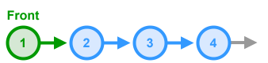

# Queue - Linked List Implementation



This is a simple implementation a generic **Queue** using a **singly linked list** under the hood. It supports standard **FIFO** operations: `enqueue`, `dequeue`, peek (`front`), and emptiness check, plus a `toString` helper.

## Breakdown

1. **Node Definition**
   - Each node holds a generic `data` value and a reference `next` to the node below it.
2. **Initialization**
   - Maintain two pointers:  
     • `start` → first node in the queue  
     • `end`   → last node in the queue
   - Both begin as `null` when the queue is empty.
3. `enqueue`
   - Create a new node for the item.
   - If the queue is empty (`end` is `null`), set both `start` and `end` to this new node.
   - Otherwise, link the new node to `end.next` and update `end` to the new node.
4. `dequeue`
   - If the queue is empty (`start` is `null`), return `undefined`.
   - Otherwise, capture the data in the `start` node, advance `start` to `start.next`.
   - If the new `start` is `null`, also reset `end` to `null`.
   - Return the captured data.
5. `front` (`peek`)
   - If empty, return `undefined`; otherwise, return `start.data`.
6. `isEmpty`
   - Return `true` if `start` is `null`, else `false`.
7. `toString` (optional)
   - Traverse from `start` to the end, collect each node’s data in an array.
   - Join with `→` arrows and wrap with square brackets.

## TypeScript Implementation

* **Time Complexities**
    * `enqueue` - $O(1)$
    * `dequeue` - $O(1)$
    * `front` - $O(1)$
    * `isEmpty` - $O(1)$
    * `toString` - $O(n)$

```ts
/**
 * Represents a single node in a queue
 */
class QueueNode<T> {
  // The data stored by the node
  data: T;
  // The next node in the linked list
  next: QueueNode<T> | null;
  constructor(data: T, next: QueueNode<T> | null = null) {
    this.data = data;
    this.next = next;
  }
}

/**
 * Simple implementation of a Queue represented using a Linked List
 */
class LinkedQueue<T> {
  // Represents the node at the front of the queue
  private start: QueueNode<T> | null;
  // Represents the node at the back of the queue
  private end: QueueNode<T> | null;

  constructor() {
    this.start = null;
    this.end = null;
  }
  
  /**
   * Adds a new item to the back of the queue.
   * @param item Item to add to the queue
   */
  enqueue(item: T): void {
    if (this.end === null) {
      this.start = this.end = new QueueNode(item);
    } else {
      const node = new QueueNode(item);
      this.end.next = node;
      this.end = node;
    }
  }

  /**
   * Removes an item from the front of the queue and returns it.
   * @returns The removed item
   */
  dequeue(): T | undefined {
    // Handle edge cases
    if (this.start === null) return undefined;
    const data = this.start.data;
    this.start = this.start.next;
    if (this.start === null) {
      // Update the end pointer if the list is now empty
      this.end = null;
    }
    return data;
  }

  /**
   * Returns the item at the front of the queue without removing it.
   * @returns The item at the front of the queue
   */
  front(): T | undefined {
    if (this.start === null) return undefined;
    return this.start.data;
  }

  /**
   * Returns true if there are no items in the queue
   */
  isEmpty(): boolean {
    return this.start === null;
  }
  
  /**
   * Override for the `toString` method to create a string 
   * representation of the queue. 
   */
  toString(): string {
    if (this.start === null) return '[]';
    const nodes: T[] = [];
    let current = this.start;
    while (current !== null) {
      nodes.push(current.data);
      current = current.next;
    }
    return `[ ${nodes.join(' → ')} ]`;
  }
}

```