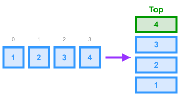

# Stack - Array Implementation



> **NOTE**: In TypeScript, it isn't really necessary to implement a custom `Stack` class for an array-based implementation, because the functionality is already built into arrays. This implementation is just for demonstration. In actual practice/interviews, you should use the built-in array functions to save yourself time.

## Breakdown

1. **Underlying Storage**
    - Maintain a private array to hold stack elements in insertion order.
2. **Initialization**
    - Constructor takes an optional array of preset items and assigns it to the internal array.
3. **push(item)**
    - Append `item` to the end of the internal array.
4. **pop()**
    - Remove and return the last element of the array; if empty, return `undefined`.
5. **peek()**
    - Return the last element without mutation; if empty, return `undefined`.
6. **isEmpty()**
    - Check if the internal array’s length is zero and return a boolean.
7. **toString()** (optional)
    - Override to produce a string like `"[elem1,elem2,elem3]"` based on the array contents. This is used in debugging, so it's not strictly necessary.

## TypeScript Implementation

* **Time Complexities**
  * `push` - $O(1)$
  * `pop` - $O(1)$
  * `peek` - $O(1)$
  * `isEmpty` - $O(1)$
  * `toString` - $O(n)$

```ts
/**
 * Simple custom class implementation of a Stack using an array
 */
class Stack<T> {
  // Represents the items currently in the stack
  private readonly items: T[];

  /**
   * Creates a new instance of the Stack class
   * @param items Preset items to add to the stack
   */
  constructor(items: T[] = []) {
    this.items = items || [];
  }

  /**
   * Adds a new item to the top of the stack
   * @param item Item to add to the stack
   */
  push(item: T): void {
    this.items.push(item);
  }

  /**
   * Removes an item from the top (end) of the stack and returns the item.
   * @returns The item that was removed from the stack
   */
  pop(): T | undefined {
    return this.items.pop();
  }

  /**
   * Returns the element at the top of the stack without removing it.
   * @returns The top element of the stack
   */
  peek(): T | undefined {
    return this.items[this.items.length - 1];
  }

  /**
   * Returns true if the stack currently has no items.
   */
  isEmpty(): boolean {
    return this.items.length === 0;
  }

  /**
   * Override for the `toString` method to create a string 
   * representation of the stack. 
   */
  toString(): string {
    return `[${this.items}]`;
  }
}
```