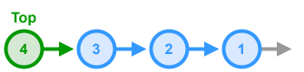

# Stack - Linked List Implementation



This is a simple implementation a generic **Stack** using a **singly linked list** under the hood. It supports standard **LIFO** operations: `push`, `pop`, `peek`, and emptiness check, plus a `toString` helper.

## Breakdown

1. **Node Definition**
    - Each node holds a generic `data` value and a reference `next` to the node below it.
2. **`top` Pointer**
    - A private member that points to the head of the list (the stack’s top element).
    - When `top` is `null`, the stack is empty.
3. **`push(item: T): void`**
    - Create a new node with `data = item` and `next = current top`.
    - Update `top` to reference this new node.
4. **`pop(): T | undefined`**
    - If `top` is `null`, return `undefined`.
    - Otherwise, store `top.data`, advance `top` to `top.next`, and return the stored data.
5. **`peek(): T | undefined`**
    - Return `undefined` if `top` is `null`; otherwise return `top.data` without modifying the stack.
6. **`isEmpty(): boolean`**
    - Check whether `top` is `null`.
7. **`toString(): string`**
    - If empty, return `[]`.
    - Otherwise, traverse from `top` down the `next` pointers, collect each `data` in an array, then return a string like `[ a → b → c ]`.

## TypeScript Implementation

* **Time Complexities**
    * `push` - $O(1)$
    * `pop` - $O(1)$
    * `peek` - $O(1)$
    * `isEmpty` - $O(1)$
    * `toString` - $O(n)$

```ts
/**
 * Represents a single node in a stack
 */
class StackNode<T> {
  // The data stored by the node
  data: T;
  // The next node in the linked list
  next: StackNode<T> | null;
  constructor(data: T, next: StackNode<T> | null = null) {
    this.data = data;
    this.next = next;
  }
}

/**
 * Simple implementation of a Stack represented using a Linked List
 */
class LinkedStack<T> {
  // Represents the top of the stack or the head of the linked list
  private top: StackNode<T> | null;

  constructor() {
    this.top = null;
  }

  /**
   * Adds a new item to the top of the stack
   * @param item Item to add to the stack
   */
  push(item: T): void {
    this.top = new StackNode(item, this.top);
  }
  
  /**
   * Removes an item from the top (end) of the stack and returns the item.
   * @returns The item that was removed from the stack
   */
  pop(): T | undefined {
    if (this.top === null) return undefined;
    const data = this.top.data;
    this.top = this.top.next;
    return data;
  }
  
  /**
   * Returns the element at the top of the stack without removing it.
   * @returns The top element of the stack
   */
  peek(): T | undefined {
    if (this.top === null) return undefined;
    return this.top.data;
  }

  /**
   * Returns true if the stack currently has no items.
   */
  isEmpty(): boolean {
    return this.top === null;
  }

  /**
   * Override for the `toString` method to create a string 
   * representation of the stack. 
   */
  toString(): string {
    if (this.top === null) return `[]`;
    const nodes: T[] = [];
    let current = this.top;
    while (current !== null) {
      nodes.push(current.data);
      current = current.next;
    }
    return `[ ${nodes.join(' → ')} ]`;
  }
}
```