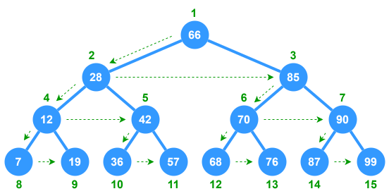
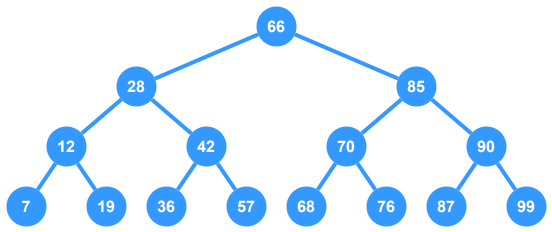

# Breadth-First Search (Iterative) - Trees



This is a simple example of an iterative **Breadth-First Search** (BFS) implementation done on a **Binary Search Tree**. The BFS function exists as a member function of the `BinarySearchTree` class and logs each node to the console as it's visited in the traversal.

## Breakdown

1. **Queue Data Structure**
    - Initialize a `queue` data structure to handle the processing of the traversal loop.
    - Begin by adding the starting node to the **end** of the `queue`.
2. **Traversal Loop**
    - Create a while loop to run as long as the traversal `queue` is **not empty**.
    - **Inside the Loop**:
        - `dequeue` a `node` from the traversal `queue`
        - Check if the `node` has already been visited -- skip processing if `true`
        - Mark the `node` as "visited"
        - Process the `node` (log it to the console)
        - Find all nodes that are in the adjacency list for `node` and `enqueue` each one that hasn't been visited yet.
3. **Termination**
    - Once the `queue` is empty, the traversal is complete.

> **NOTE:** Since this is a tree and connections can only go in one direction, there is no need to create a 'visited' list to track visited nodes.

## TypeScript Implementation

This implementation uses a **Binary Search Tree** as the subject of traversal.



The BFS function is a member of the `BinarySearchTree` class and takes a starting node as a parameter. For the purposes of this implementation, "processing" a node simply means to log it to the console.


```ts
import { BinaryTreeNode, BinarySearchTree } from "saved/Data/Trees/binary-search-tree";

class BFSTree extends BinarySearchTree {
  /**
   * Performs Breadth-First Search traversal on the tree starting 
   * at the given `start` node. Each node is processed by logging 
   * it's value to the console.
   * @param start Starting node of the traversal
   */
  public bfs(start: number): void {
    // Get the node with the given starting value
    const startNode = this.find(start);
    // Only proceed if the start node exists in the tree
    if (startNode === null) return;

    // Initialize the queue to handle the traversal loop
    const queue: BinaryTreeNode[] = [];

    // Begin by adding the starting node to the queue
    queue.push(startNode);

    // Iterate over queue until empty
    while (queue.length > 0) {
      // Dequeue a node from the front of the queue
      const node = queue.shift();
      // Process the node
      console.log(node.value);
      // Add the left child to the queue if it exists
      if (node.left !== null) {
        queue.push(node.left);
      }
      // Add the right child to the queue if it exists
      if (node.right !== null) {
        queue.push(node.right);
      }
    }
  }
}

const bst = new BFSTree();
bst.insert(66,28,85,12,42,70,90,7,19,36,57,68,76,87,99);

bst.bfs(66);

// Output:
// 66
// 28
// 85
// 12
// 42
// 70
// 90
// 7
// 19
// 36
// 57
// 68
// 76
// 87
// 99
```