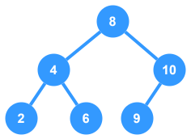

# Binary Search Tree



## Breakdown

- **Binary Tree Node**: A `BinaryTreeNode` class is used to represent each `node` in the tree; it has the following properties:
  - **value**: `number` - Represents the data value of the node
  - **left**: `BinaryTreeNode` - Represents the left child of the node
  - **right**: `BinaryTreeNode` - Represents the right child of the node
- **Insert**: Insert's a new node with the given `value` at the correct spot in the tree.
- **Remove**: Deletes the node with the given `value`
  - If no node exists, nothing happens
  - If node has no children, then the node is simply removed
  - If the node has one child, then it is replaced with that child
  - If the node has two children, then the bottom leftmost child of the right branch of the node is chosen as the node's successor
- **Find**: Finds the node with the given node `value`
- **Print Tree**: Debug function to print the current nodes in the tree (level by level)


## TypeScript Implementation

```ts
/**
 * The main tree node class for Binary Trees
 */
class BinaryTreeNode {
  // Value stored as a number
  public value: number;
  // Left child node
  public left: BinaryTreeNode;
  // Right child node
  public right: BinaryTreeNode;

  constructor(value: number) {
    this.value = value;
    this.left = null;
    this.right = null;
  }
}

/**
 * Simple implementation of a Binary Search Tree
 */
class BinarySearchTree {
  // The root tree node
  private root: BinaryTreeNode;

  /**
   * Creates a new instance of the BST class
   * @param rootValue Value to set for the root
   */
  constructor() {
    this.root = null;
  }

  /**
   * Returns the node with the given value if it exists,
   * `null` if not.
   * @param value Value to look for
   * @returns Tree node with the given `value` or `null`
   */
  public find(value: number): BinaryTreeNode | null {
    let curNode = this.root;

    // Use Binary Search to traverse the nodes 
    while (curNode != null) {
      if (curNode.value === value) {
        // If this is the node we're looking for, return it
        return curNode;
      } else if (curNode.value > value) {
        // If the target value is less than the current node value, go left
        curNode = curNode.left;
      } else {
        // Otherwise, go right
        curNode = curNode.right;
      }
    }

    return null;
  }

  /**
   * Inserts a new node (or nodes) into the tree with
   * a specific value.
   * @param values Values to set for the new nodes
   */
  public insert(...values: number[]): void {
    for (const value of values) {
      if (this.root === null) {
        this.root = new BinaryTreeNode(value);
        continue;
      }

      let curNode = this.root;

      // Traverse the tree to find the ideal location
      while (curNode != null) {
        // Compare the incoming value to the current node's value
        if (value < curNode.value) {
          // If less, go to the left side
          if (curNode.left === null) {
            // If there is no child node here, create it
            curNode.left = new BinaryTreeNode(value);
            break;// Exit the loop
          } else {
            curNode = curNode.left;
          }
        } else {
          // If greater, go to the right side
          if (curNode.right === null) {
            // If there is no child node here, create it
            curNode.right = new BinaryTreeNode(value);
            break; // Exit the loop
          } else {
            curNode = curNode.right;
          }
        }
      }
    }
  }

  /**
   * Removes the node with the given `value` from the tree.
   * @param value Value of the node to remove
   */
  public remove(value: number): void {
    // Call recursive removal function on the root
    this.root = this._remove(this.root, value);
  }

  /**
   * Recursive function to remove a node with a given `value` starting at the
   * given `node`. Returns a node to be used as the current nodes's child.
   * @param node Node to start on
   * @param value Value to find and remove
   * @returns
   */
  private _remove(node: BinaryTreeNode, value: number): BinaryTreeNode | null {
    if (node === null) return null;

    // Find the value
    if (value < node.value) {
      // Continue down left subtree
      node.left = this._remove(node.left, value);
      return node;
    } else if (value > node.value) {
      // Continue down right subtree
      node.right = this._remove(node.right, value);
      return node;
    }

    // If we are at this point, then this is the target node, handle cases

    // Case 1: No children
    if (node.left === null && node.right === null) {
      return null; // Nulls out the parent node's child pointer for the deleted node
    }

    // Case 2: Only One Child
    if (node.left === null) {
      // Only the right child exists, return that as the new child node of the parent
      return node.right;
    } else if (node.right === null) {
      // Only the left child exists, return that as the new child node of the parent
      return node.left;
    }

    // Case 3: Two Children
    // If the node has both children, we need to pick the best successor to take the 
    // place of the removed node.

    // Create a pointer to the successor parent so we properly swap
    let parent = node; // Start off with the current node as parent
    let successor = node.right; // Begin with the right side
    while (successor.left !== null) {
      parent = successor;
      successor = successor.left;
    }

    // At this point, we have found the successor, now we need to swap.
    node.value = successor.value;

    // Delete the old successor node to clear the duplicate
    // To do this, we have to call the _remove function again to 
    // properly handle any existing children on the successor's right
    // side.
    if (successor === parent.left) {
      parent.left = this._remove(parent.left, parent.left.value);
    } else {
      parent.right = this._remove(parent.right, parent.right.value);
    }

    // Return the modified node
    return node;
  }

  /**
   * Prints the current tree to the console.
   */
  public print(): void {

    // Call recursive print helper function on root node
    printHelper(this.root, 0);

    /**
     * Recursive function to print all the nodes
     */
    function printHelper(node: BinaryTreeNode, depth: number): void {
      let tab = '';
      for (let i = 0; i < depth; i++) {
        tab += '  ';
      }
      console.log(`${tab}${node.value}`);
      ++depth;
      if (node.left !== null) {
        printHelper(node.left, depth);
      }
      if (node.right !== null) {
        printHelper(node.right, depth);
      }
    }
  }

}


const bst = new BinarySearchTree();

bst.insert(8);
bst.insert(4);
bst.insert(10);
bst.insert(2);
bst.insert(6);
bst.insert(9);
bst.print();

// Answer
// 8
//   4
//     2
//     6
//   10
//     9
```