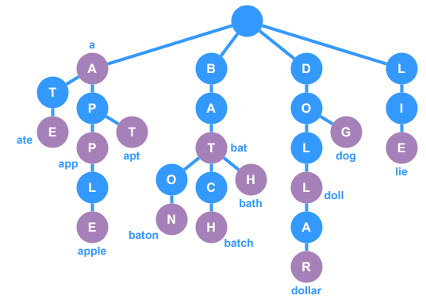

# Trie - Delete Node

This is an example implementation of a `delete` method within a `Trie` class. The method uses a nested, recursive method to check the trie for the word and delete and nodes that can be deleted.

### Dependencies
* [TrieNode](Trie%20-%20Node.md) - The node class
* [BaseTrie](Trie%20-%20Basic.md) - Base Trie class with common functions (insert, find, print, etc.)

## Breakdown
- **Main `delete` Function**
  - Immediately return `false` if the word is empty.
  - Use a variable `result` to keep track of whether the deletion was successful.
  - Call a recursive helper to traverse the trie starting from the `root` with an initial index of `0`.
- **Recursive Helper Function**
  - **Base Case – End of Word**: When the current index equals the length of the word:
    - Verify that the `current` node is marked as the end of a valid word.
    - If valid, remove the `terminal` flag to indicate the word is removed from the trie.
    - Decide if the node can be safely removed (if it has no children).
  - **Recursive Case – Processing Each Character**
    - Retrieve the character at the `current` index.
    - If the `current` node does not have a corresponding child, the word isn’t in the trie—make sure to **signal failure**.
    - Recursively call the helper for the child node (incrementing the index).
    - If the recursive call indicates that the child node can be removed, remove that child.
    - Determine if the `current` node should also be removed (if it has no children and is not marked as a `terminal`).
- After the recursive deletion, return the success tracker `result`.
- The final boolean indicates whether the word was successfully removed from the trie, along with the necessary node cleanup.

## TypeScript Implementation



```ts
import { TrieNode } from "./trie-node";
import { BaseTrie } from "./trie";

class Trie extends BaseTrie {
  /**
   * Attempts to delete the given `word` and returns `true` if the operation
   * is successful or `false` if not.
   * @param word The word to delete from the trie
   */
  public delete(word: string): boolean {
    // No word to delete, failed operation
    if (word.length === 0) return false;
    // Create a variable to track the overall success of the operation
    let result = false;
    // Call recursive delete function starting at the root
    shouldDeleteNode(this.root, 0);
    /**
     * Recursively iterates through the node chain to remove the given `word`
     * AND remove any childless nodes that exist after the word is removed.
     * @param node The current node in the trie
     * @param index The current index being visited in the recursion
     * @returns True if the node can be safely deleted, false if not
     */
    function shouldDeleteNode(node: TrieNode, index: number): boolean {
      // Check if we reached the end of the word
      if (index === word.length) {
        // If the last letter of the word is not terminal, it isn't in the trie
        if (!node.isTerminal) {
          result = false;
          return false;
        }
        // Disable the terminal flag, because this no longer represents a valid word
        node.isTerminal = false;
        // The result of the overall delete function should be `true` at this point
        result = true;
        // Return `true` only if this node can be safely deleted
        return node.count === 0;
      }
      // If we are at this point, then we haven't gotten to the end of the word
      // Pull the next character from the word
      const char = word[index];
      // Fail the process if the current node doesn't have the next letter
      if (node.count === 0 || !node.hasChild(char)) {
        result = false;
        return false;
      }
      // Recursively call this function again on the child node to see if it 
      // needs to be deleted after this operation
      const willDeleteChild = shouldDeleteNode(node.getChild(char), ++index);
      if (willDeleteChild) {
        node.removeChild(char);
        // Only return true if this node can be safely deleted
        return node.count === 0 && !node.isTerminal;
      } else {
        // Cannot delete the child node, so this node still has children.
        // This means it cannot be deleted, so return false.
        return false;
      }
    }
    // Return the final state of `result`
    return result;
  }
}

const myTrie = Trie.fromWords(
  "a", "apple", "ate", "apt", "app",
  "bat", "bath", "batch", "baton",
  "dog", "doll", "dollar",
  "lie"
) as Trie;

myTrie.print();
// Output:
// a
// app   
// apple 
// apt   
// ate   
// bat   
// bath  
// batch 
// baton 
// dog   
// doll  
// dollar
// lie 

console.log(myTrie.delete('bath')); // true
myTrie.print();
// Output:
// a     
// app   
// apple 
// apt   
// ate   
// bat   
// batch 
// baton 
// dog
// doll
// dollar
// lie

console.log(myTrie.delete('bath')); // false -- word no longer exists
console.log(myTrie.delete('ba')); // false -- not a valid word
console.log(myTrie.delete('bat')); // true -- leaves all letters in the trie 
myTrie.print();
// Output:
// a
// app
// apple
// apt
// ate
// batch
// baton
// dog
// doll
// dollar
// lie
```