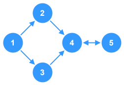
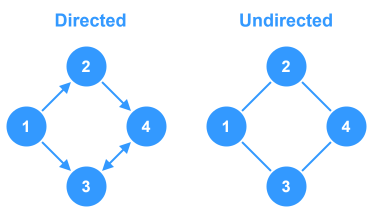
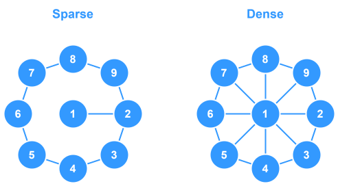
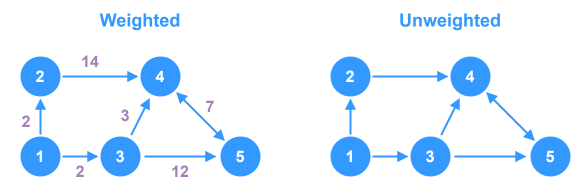
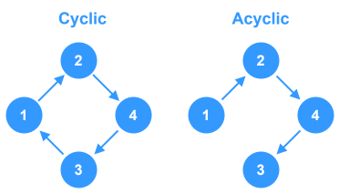
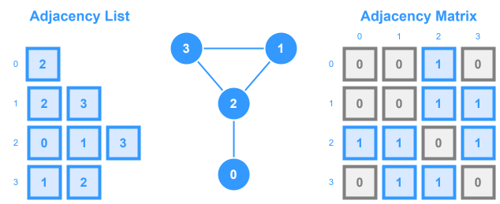

# Graphs



A `graph` is a non‑linear data structure that consists of a set of `vertices` (or `nodes`) and `edges` connecting pairs of `vertices`. Graphs can represent various real‑world structures such as social networks, transportation maps, dependency relationships, and more. A `graph` is simply a collection of `vertices` with some `edges` between them.

A `tree` is a type of `graph`, but not all `graphs` are `trees`. Simply put, a `tree` is a connected `graph` without `cycles`.


## Term Definitions
- `vertex` - Refers to a node in the graph
- `edge` - A connection from one `vertex` to another.
- `degree` - The number of `edges` a single `vertex` has
- `cycle` - Indicates that there is a closed loop within the graph structure

---

## Types of Graphs

### Directed vs. Undirected



In a `directed` graph, `edges` have a direction (from one `vertex` to another).
* Edges have a specific start and end point, indicated by an arrow.
* An edge connecting node A to node B is different from an edge connecting node B to node A.
* If there's an edge from A to B, it doesn't automatically imply an edge from B to A.

In an `undirected` graph, `edges` are **bidirectional**.
* Edges are represented by a line connecting two nodes, without arrows indicating direction.
* An edge connecting node A to node B is the same as an edge connecting node B to node A.
* If there's an edge between A and B, there's also an edge between B and A.

### Sparse vs. Dense



`Sparse` graphs have relatively few `edges` compared to the maximum possible, while `dense` graphs have many edges.

### Weighted vs. Unweighted



A `weighted` graph assigns a cost or weight to each `edge`, whereas an `unweighted` graph treats all `edges` equally.

### Cyclic vs. Acyclic



A `cyclic` graph contains paths that start from one vertex and end up coming back to that vertex. An `acyclic` graph contains none of these closed loop paths.

### Cycles

In graph theory, a `cycle` is defined as a path that starts and ends at the same `vertex`, with all `edges` (and typically all `vertices`, except the starting/end point) being distinct. Here are some key details:

- **Undirected Graphs:**  
  A `cycle` in an undirected graph is a path where you can begin at a `vertex`, traverse a sequence of connected `edges`, and eventually return to the same `vertex` without reusing any `edge`. Often, a simple `cycle` is defined where no `vertex` is repeated except for the starting/ending `vertex`.

- **Directed Graphs:**  
  In directed graphs, the `cycle` must follow the direction of the `edges`. That is, a `cycle` is a sequence of `vertices` connected by directed `edges`, where you eventually return to the starting `vertex` while respecting the `edge` directions.

- **Special Case – Self-loop:**  
  A self-loop—an `edge` that connects a `vertex` to itself—is also considered a `cycle`.

Essentially, a `cycle` indicates that there is a closed loop within the graph structure. This concept is crucial for various algorithms, such as `cycle` detection, topological sorting, and network flow problems.

---

## Common Representations

Graph algorithms work on these representations to traverse, search, or analyze the structure (e.g., finding the shortest path, detecting `cycles`, or performing topological sorting).



### Adjacency List

Uses a list (or map/hash) where each key is a `vertex` and its value is a list of neighboring `vertices`. This representation is space‑efficient for `sparse` graphs.

```ts
// Adjacency List
const adjacencyList: number[][] = [
  [2], // 0
  [2, 3], // 1
  [0, 1, 3], // 2
  [1, 2] // 3
];

// Adjacency Map
const adjacencyMap: Map<number, number[]> = new Map([
  [0, [2]],
  [1, [2, 3]],
  [2, [0, 1, 3]],
  [3, [1, 2]]
]);
```

### Adjacency Matrix

Uses a 2D array to represent connections between `vertices`. This is beneficial for `dense` graphs but consumes `O(V²)` space.

```ts
// Adjacency Matrix
const adjacencyMatrix: number[][] = [
  [0, 0, 1, 0],
  [0, 0, 1, 1],
  [1, 1, 0, 1],
  [0, 1, 1, 0],
];
```

---

## Common Graph Functions

* **Constructor** - Creates a new graph and initializes the base variables (if necessary)
* **Add Vertex** - Adds a new `vertex` (or node) into the graph
* **Add Edge** - Creates a new connection between two `vertices`
* **Print** - Utility function to print the graph's adjacency list.

### Somewhat Less Common

* **Remove Vertex** - Removes a vertex and all associated `edges`.
* **Remove Edge** - Removes an edge between two `vertices`.

---

## Time and Space Complexity

Assuming you implement a graph using an **adjacency list** for a graph with $V$ `vertices` and $E$ `edges`:

- **Search / Traversal:**
    - **Breadth‑First Search (BFS)** and **Depth‑First Search (DFS):**
        - **Time Complexity:** $O(V + E)$ because you visit every `vertex` and traverse every `edge` in the worst case.
        - **Space Complexity:** $O(V)$, mainly for storing the visited set and the recursion/queue overhead.

- **Insertion:**
    - **Insert Vertex:** $O(1)$ on average (if using a hash map or dictionary)
    - **Insert Edge:** $O(1)$ (after accessing the vertex’s neighbor list)

- **Deletion:**
    - **Delete Edge:** $O(V)$ in the worst case if you search through a list to remove the `edge`, though using more advanced data structures (like a hash set for neighbors) can push this closer to $O(1)$ on average.
    - **Delete Vertex:** $O(V + E)$ in the worst case since you need to remove the vertex and update/remove all `edges` connected to it.

- **Space Complexity for the Graph:**
    - $O(V + E)$ for the adjacency list representation, which is generally more efficient than an adjacency matrix ($O(V^2)$) unless the graph is very dense.

---

## Edge Cases

### **Disconnected Graphs:**
A graph may consist of several disconnected components. When traversing, ensure that you visit each component (often by iterating over all vertices and performing a traversal if the vertex hasn’t been visited).

### **Self-loops:**
An edge that connects a vertex to itself can sometimes introduce complications in traversal or cycle detection if not handled properly.

### **Parallel Edges:**
Some graphs allow multiple edges (i.e., parallel edges) between the same two vertices. Decide early whether your implementation will allow or ignore duplicates.

### **Directed Graph Nuances:**
In directed graphs, be mindful that the relationship is one‑way. Traversal must follow the direction of the edge, which may affect algorithms such as cycle detection and topological sort.

### **Edge Removal/Insertion Errors:**
When removing vertices or edges, ensure that updates are reflected across the entire data structure to avoid stale or orphaned references.

---

## When to Use Graphs

Graphs are ideal for scenarios where relationships between entities or nodes are complex and non‑linear. Typical scenarios include:

### **Navigation Problems:**
Finding the shortest path (e.g., using Dijkstra’s algorithm) in road maps or network routing.

### **Social Networks:**
Modeling relationships between users, finding communities, or detecting influencers.

### **Dependency Resolution:**
Modeling prerequisites in course scheduling or task dependencies (often solved with topological sort).

### **Connectivity Problems:**
Detecting connected components (e.g., “Number of Islands”, “Friend Circles”) or cycles in a network.

### **Search and Traversal Scenarios:**
Problems like “Clone Graph”, or puzzles that rely on exploring every state (backtracking).

Use graphs when the problem inherently involves pairwise relationships that are neither strictly linear nor hierarchical.

---

## LeetCode Questions

- **Number of Islands**
    - **Topics:** DFS/BFS
    - **Details:** Given a 2D grid map, count the number of islands.
    - **Prerequisites:** Familiarity with grid traversal (which is conceptually similar to graph traversal).
- **Clone Graph**
    - **Topics:** Graph Traversal (BFS/DFS)
    - **Details:** Given a reference to a node in a connected undirected graph, return a deep copy (clone) of the graph.
    - **Prerequisites:** Understanding recursive DFS or iterative BFS.
- **Course Schedule** (I & II)
    - **Topics:** Topological Sort, DFS, BFS
    - **Details:** Determine if it’s possible to finish all courses given prerequisites, and find an ordering of courses.
    - **Prerequisites:** Graph representation (directed graphs) and cycle detection.
- **Graph Valid Tree**
    - **Topics:** DFS/BFS, Union Find
    - **Details:** Given n nodes and a list of edges, determine if these edges make up a valid tree (i.e., connected and acyclic).
    - **Prerequisites:** Basic graph traversal or disjoint-set (Union Find) methods.
- **Network Delay Time**
    - **Topics:** Dijkstra’s Algorithm
    - **Details:** Find the time it takes for all nodes to receive a signal sent from a starting node in a weighted directed graph.
    - **Prerequisites:** Priority queues (heaps) and graph traversal in weighted graphs.
