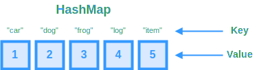

# Hash Table



A `hash table` (commonly referred to as a "hash map" or "dictionary") is a data structure that implements an associative array abstract data type, a structure that can map `keys` to `values`. It uses a hash function to compute an index from a key so that the corresponding value can be quickly retrieved, added, or removed. Because of this, hash maps are prized for their average-case constant-time complexity, $O(1)$, for these operations.

> **Note**: Keys in a Hash Table are immutable and cannot be changed after assignment and so data types for keys must always be immutable types

### Key Characteristics

- **Key–Value Association:** Each entry in the table is stored as a key–value pair.
- **Hash Function:** Converts a key into an index efficiently.
- **Collision Resolution:** Since multiple keys may hash to the same index, techniques like **separate chaining** (storing a list/chain of entries in one bucket) or **open addressing** (finding another slot) are used.
- **Dynamic Resizing:** To maintain efficient operations, the underlying array is often resized (and rehashed) when the load factor (number of elements divided by capacity) exceeds a threshold.
___

### Time Complexity

- Insert: $O(1)$
- Delete: $O(1)$
- Search: $O(1)$

### Space Complexity

$O(n)$

At a minimum, space for the keys and values plus overhead for the buckets. Additionally, occasional resizing incurs extra space cost temporarily.

___

## Benefits of Hash Tables
* Hash tables offer better readability of code and are generally easier to work with.
* Offers $O(1)$ time scaling for search operations in comparison to arrays/linked lists which offer only $O(n)$ scaling
___

## Pitfalls and Caveats
- **Worst-Case Performance:**
    - Although average-case is O(1), worst-case degrades to O(n) if many collisions occur. This is rare with good hash functions and proper resizing.
- **Iteration Order:**
    - Standard hash maps do not guarantee any specific order when iterating over keys. If order matters, consider an ordered variant.
- **Memory Overhead:**
    - Hash maps trade off memory usage (extra space for buckets and pointers) for faster operations.
- **Resizing Costs:**
    - Resizing (rehashing) may occur if the load factor threshold is exceeded. Although amortized cost is low, it’s something to keep in mind in performance-critical scenarios.
___

## When to Use and When to Avoid
- **Use Hash Maps When:**
    - You need quick lookup, insertion, and deletion.
    - Frequency counting, grouping, caching, or quick existence checks are required.

- **Consider Alternatives When:**
    - Ordering is crucial and needs to be maintained (consider `TreeMap` or `LinkedHashMap` in Java, or `OrderedDict` in Python).
    - Memory is highly constrained; sometimes a more memory-efficient data structure might be appropriate.
___

## Example Implementation

In TypeScript, there are several ways to implement a `hash table`.

### Using `Map` 

The `Map` class is a fairly straightforward way to implement a `hash map` as it has many built-in features to handle common operations. However, these built-in features do add some overhead in terms of runtime/space, so it's not the most efficient implementation.

```ts
const hashTable = new Map<string,number>();
hashTable.set("myKey", 1); // O(1)
hashTable.get("myKey"); // O(1)
hashTable.has("myKey"); // O(1)
```

### Using `Set`

The `Set` class is a great choice if you don't need to associate a specific value with your key. An example would be when you need to check for the existence of something (like you would when checking for unique values or duplicates).
```ts
const hashSet = new Set<number>();
hashSet.add(1); // O(1)
hashSet.has(1); // O(1)
```

### Using `Record`

The `Record` class operates very similarly to the `Map` class in that you can use it to store hashed keys that point to specific values. The difference is that it doesn't carry the same overhead. The drawback to this is that some of the operations using `Record` are a little less intuitive. Essentially, a `Record` object is just a simple JavaScript object `{}` where the properties are the keys.

```ts
// The constructor is the same as a simple object
const record: Record<string,number> = {};
// Set operations are simple
record["myKey"] = 1;
// Get operations are simple as well
console.log(record["myKey"]); // 1
// Key checking operations
if ("myKey" in record) {}
```

___

## How Hash Maps Work

### 1. The Hash Function
- **Purpose:** Converts a key into an integer (the hash code) that is then used to find an index in an underlying array.
- **Quality Matters:** A “good” hash function distributes keys uniformly across buckets. Poor hash functions can lead to many collisions (different keys ending up in the same bucket).

### 2. Collision Resolution
Even with a good hash function, collisions are inevitable. Here are two common strategies for handling them:

- **Chaining:**
    - Each bucket (or slot) in the hash table holds a list (or another secondary data structure such as a balanced tree) of all elements whose keys hash to that bucket.
    - When searching, you traverse the list in that bucket.

- **Open Addressing:**
    - When a collision occurs, the algorithm probes for the next available slot using various methods (e.g., linear probing, quadratic probing, or double hashing).
    - All elements are stored within the hash table itself.

### 3. Load Factor and Resizing
- **Load Factor:** The ratio of entries to the total number of buckets. A high load factor means more collisions.
- **Resizing/Rehashing:**
    - When the load factor exceeds a predefined threshold (commonly 0.7–0.75), the hash table is resized (usually doubling in size) and all existing entries are rehashed to new indices.
    - This operation is typically costly ($O(n)$), but it happens infrequently enough that the amortized cost for insertion remains $O(1)$.
___

## LeetCode Questions

- **[Two Sum](https://leetcode.com/problems/two-sum/)**  
  **Description:** Find two numbers that add up to a target value.  
  **Dependencies:** Basic arrays and hash table lookups.

- **[Valid Anagram](https://leetcode.com/problems/valid-anagram/)**  
  **Description:** Determine if two strings are anagrams.  
  **Dependencies:** Array manipulation and frequency counts with hash tables.

- **[Group Anagrams](https://leetcode.com/problems/group-anagrams/)**  
  **Description:** Group strings that are anagrams of each other.  
  **Dependencies:** Sorting strings (or using character frequency) combined with hash table grouping.

- **[Contains Duplicate](https://leetcode.com/problems/contains-duplicate/)**  
  **Description:** Check if an array contains any duplicates.  
  **Dependencies:** Simple iteration and hash table for fast membership checking.

- **[Top K Frequent Elements](https://leetcode.com/problems/top-k-frequent-elements/)**  
  **Description:** Find the k most frequent elements in an array.  
  **Dependencies:** Hash table for frequency counting combined with sorting or min-heaps.

- **[Subarray Sum Equals K](https://leetcode.com/problems/subarray-sum-equals-k/)**  
  **Description:** Find the number of subarrays that sum to a target value.  
  **Dependencies:** Uses prefix sums and hash table lookups.

- **[Longest Consecutive Sequence](https://leetcode.com/problems/longest-consecutive-sequence/)**  
  **Description:** Given an unsorted array, find the length of the longest consecutive elements sequence.  
  **Dependencies:** Hash sets (a close relative of hash tables) for fast lookups.

- **[LRU Cache](https://leetcode.com/problems/lru-cache/)**  
  **Description:** Design and implement a data structure for Least Recently Used (LRU) cache.  
  **Dependencies:** While largely centered around hash tables for $O(1)$ lookups, it also requires a double-linked list for managing order.