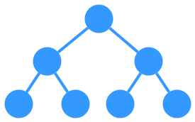
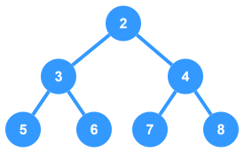
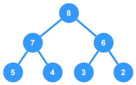
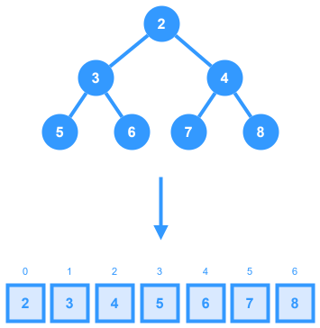
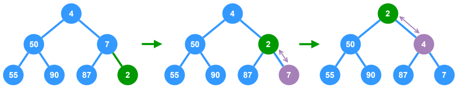
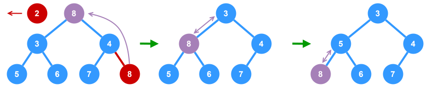

# Heap



A `heap` is a `complete binary tree` that follows either the `min heap` or `max heap` principal.

In the context of algorithm interviews, `heaps` and `priority queues` can be treated as the same data structure. A `heap` is a useful data structure when it is necessary to repeatedly remove the object with the highest (or lowest) priority, or when insertions need to be interspersed with removals of the root node.

### Min Heap



In a `min heap`, the value of a node must be smallest among the node values in its entire subtree. The same property must be recursively true for all nodes in the tree. The `root`, therefore, is the _minimum_ element in the tree.

### Max Heap



In a `max heap`, the value of a node must be greatest among the node values in its entire subtree. The same property must be recursively true for all nodes in the tree. The `root`, therefore, is the _maximum_ element in the tree.

### Heaps Represented as Arrays

Due to the principals that make up a `heap`, any `heap` can be represented as an `array` structure.



When implemented using `arrays`, the following is true of any element at index $i$ in a `heap`:
- **Parent Index**: $floor((i - 1) \div 2)$
- **Left Child Index**: $(2i + 1)$
- **Right Child Index**: $(2i + 2)$
___

## Common Operations

There are four key operations for a `heap`:

- **Insert**: Inserts a new element into the `heap`.
- **Extract Max/Min**: Removes the `root` element and returns its value.
- **Peek**: Returns the `root` element _without_ removing it.
- **Heapify**: Converts an unsorted array into a `heap`.
- **Remove**: Removes a single node from the `heap` and re-orders the affected nodes.
___

## Time/Space Complexity

### Time Complexity
- **Insert**: $O(\log(n))$
  - Adding a new element involves placing it at the end and then “bubbling up” to restore the heap property, which in the worst-case takes logarithmic time.
- **Remove**: $O(\log(n))$
  - Removing the `root` requires replacing it with the last element and then “bubbling down” to reheapify, which takes $O(\log(n))$ time in the worst case.
- **Peek**: $O(1)$
  - Peeking at the top element (the minimum for a `min‑heap` or maximum for a `max‑heap`) is a constant-time operation since it is stored at index `0`.
- **Heapify**: $O(n)$
  - The bottom-up heap construction method achieves a linear running time, despite the fact that each individual “bubble down” can take $O(\log(n))$. This is due to most elements being near the bottom of the tree.
- **Bubble Up**: $O(\log(n))$
  - This is the process used in the insert operation to move a newly added element upward until the heap property is restored. In the worst case, it may move from a leaf to the root.
- **Bubble Down**: $O(\log(n))$
  - Used after removal (or `heapify`), this operation moves an element down to its correct position in the heap. In the worst case, the element may travel from the root to a leaf, which takes logarithmic time.

### Space Complexity
$O(n)$ – You need space proportional to the number of elements, though if you’re sorting in place (heapsort), extra space can be minimized.
___

## Edge Cases

### Empty Heap
Ensure methods like peek or extract gracefully handle an empty structure (e.g., by returning null or throwing an appropriate error).

### Duplicate Elements
Decide whether your heap allows duplicate values. Most implementations do, but you need to ensure your comparison logic can handle duplicates correctly.

### Array Boundaries
When calculating parent/child indices, be mindful of off-by-one errors, especially if you switch between 0-indexed (common in JavaScript/TypeScript) and 1-indexed conceptual models.

### Immutable vs. Mutable Data
If your elements are objects that can change, make sure that the heap property is maintained when an element’s key changes (this may require re-heapifying).

### Heap Overflow (in Fixed-size Heaps)
If you implement a heap with a fixed-size array, ensure you handle the case where an insert might exceed the capacity.
___

## When to Use a Heap

### Priority Scheduling
Implementing a task scheduler or managing processes with different priorities.

### Graph Algorithms
Algorithms like Dijkstra’s or Prim’s that require frequent extraction of the minimum edge or vertex.

### Top-K Problems
Finding the k smallest or largest elements in a stream of data.

### Merging Sorted Lists
Merge k sorted arrays or lists efficiently.

### Heapsort
Sorting an array when an in-place $O(n \log(n))$ algorithm is needed.

### Real-Time Systems
Any system requiring quick retrieval of the highest (or lowest) priority item on the fly.
___


## Example Implementations

The following methods are commonly used when working with heaps and will be referenced by the implementation examples below.

> **NOTE:** The following implementation examples will be done using a `min heap` of elements with numeric values.

```ts
// In these examples, `data` is already a valid min heap
let data: number[] = [4, 50, 7, 55, 90, 87];

/**
 * Swaps the element at index `a` with the element at index `b`
 * @param a Index of the element to be swapped
 * @param b Index of the element to be swapped with
 */
function swap(a: number, b: number): void {
  // Holder variable
  const temp = data[a];
  data[a] = data[b];
  data[b] = temp;
}

/**
 * Moves the element at the given `index` up the heap until it 
 * reaches the appropriate position.
 *
 * Time Complexity: `O(log n)`
 * @param index Index of the element to bubble up
 */
function bubbleUp(index: number): void {
  let currentIndex = index;
  while (currentIndex > 0) {
    // Get the parent index (floor((i - 1) / 2))
    const parentIndex = Math.floor((currentIndex - 1) / 2);
    if (data[currentIndex] < data[parentIndex]) {
      // If the element is less than it's parent, swap them
      swap(currentIndex, parentIndex);
      // Update current index to the parent index so we can start again.
      currentIndex = parentIndex;
    } else {
      // If the element is not less than it's parent, leave it
      break;
    }
  }
}

/**
 * Moves the element at the given `index` down the heap until it reaches the appropriate position.
 *
 * Time Complexity: `O(log n)`
 * @param index Index of the element to bubble down
 */
function bubbleDown(index: number): void {
  if (index < data.length) {
    // Get index of left child: (2i + 1)
    const leftChild = (2 * index) + 1;
    // Get index of right child: (2i + 2)
    const rightChild = (2 * index) + 2;
    // Track best index for swapping
    let bestIndex = index;
    
    // Compare with left child if it exists
    if (
      leftChild < data.length &&
      data[leftChild] < data[bestIndex]
    ) {
      bestIndex = leftChild;
    }
    
    // Compare with right child if it exists
    if (
      rightChild < data.length &&
      data[rightChild] < data[bestIndex]
    ) {
      bestIndex = rightChild;
    }
    
    // Only proceed if we have a new index for swapping
    if (bestIndex !== index) {
      swap(index, bestIndex);
      bubbleDown(bestIndex);
    }
  }
}
```

### Insert

When we insert into a `heap`, we always start by inserting the element at the bottom. Then we "fix" the `heap` by swapping the new element with its `parent`, until we find an appropriate spot for the element.



```ts
/**
 * Inserts a new value into the heap
 * @param value Data to be inserted into the heap
 */
function insert(value: number): void {
  data.push(value);
  bubbleUp(data.length - 1);
}

data = [4, 50, 7, 55, 90, 87];
insert(10);
// Result: [ 4, 50, 7, 55, 90, 87, 10 ]
```

### Extract Min

To extract the minimum element from the `heap`, we first need to remove the `root` element, and swap it with the last element in the `heap`. Then, we "bubble down" this element, swapping it with one of its children until the `min heap` property is restored.



```ts
/**
 * Removes the minimum element from the heap and re-orders the heap,
 * then returns the extracted element's value.
 */
function extractMin(): number {
  // Store reference to the current minimum element
  const min = data[0];
  // Pop off the last node
  const last = data.pop();
  // If we still have elements in the heap, bubble down till the min heap property is restored
  if (data.length > 0) {
    data[0] = last;
    bubbleDown(0);
  }
  return min;
}

data = [4, 50, 7, 55, 90, 87];
const min = extractMin(); // -> 4
// Result: [ 7, 50, 87, 55, 90 ]
```


### Heapify

When building a `heap` from an unsorted `array` (a.k.a.: "heapify"), we start at the middle of the `array` and then "bubble down" toward the beginning. This gives us a valid `heap`.

```ts
/**
 * Converts the unsorted `data` array into a min heap.
 */
function heapify(): void {
  // Start in the middle of the heap and work way back up to top while bubbling down each node
  for (let i = Math.floor(data.length / 2) - 1; i >= 0; i--) {
    bubbleDown(i);
  }
}

data = [55, 7, 87, 50, 4, 90];
heapify();
// Result: [ 4, 7, 87, 50, 55, 90 ]
```

___

## LeetCode Questions

* **Merge k Sorted Lists**
  * **Concepts**: Min-Heap, Linked List
  * **Prerequisites**: Basic understanding of heaps (min-heap implementation) and linked lists.

* **Top K Frequent Elements**
  * **Concepts**: Heap (often a min-heap for maintaining the top k elements), Hash Map (for frequency count)
  * **Prerequisites**: Array, hash map.

* **Find Median from Data Stream**
  * **Concepts**: Two Heaps (one min-heap and one max-heap)
  * **Prerequisites**: Priority queues and understanding of balancing data structures.

* **Kth Largest Element in a Stream**
  * **Concepts**: Heap (min-heap)
  * **Prerequisites**: Similar to the “Top K Frequent Elements”, using a heap to maintain the kth largest element.

* **Minimum Cost to Connect Sticks**
  * **Concepts**: Min-Heap for selecting the two smallest elements repeatedly
  * **Prerequisites**: Greedy algorithms and heap usage.

* **Reorganize String**
  * **Concepts**: Use of a max-heap to store character frequencies and reconstruct a valid arrangement.
  * **Prerequisites**: Heaps combined with string manipulation, and sometimes hash maps.