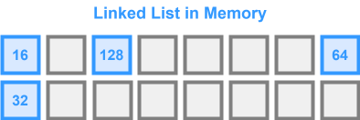
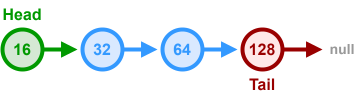
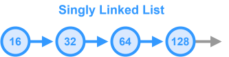
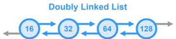
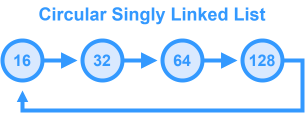
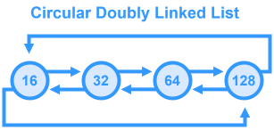

# Linked List

A `linked list` is a data structure that represents a sequence of nodes.  It is a linear collection of data elements whose order is not given by their physical placement in memory, as opposed to arrays, where data is stored in contiguous blocks of memory. Instead, each element contains an address of the next element. It is a data structure consisting of a collection of nodes which together represent a sequence.

In its most basic form, each node contains: data, and a reference (in other words, a link) to the next node in the sequence.

### Key Terms
- **Head**: The first node in the linked list
- **Tail**: The last node in the linked list. In Singly Linked Lists, the tail's `next` node will be `null`

___

## Types of Linked List

### Singly Linked List

In a **singly linked list**, each node points to the `next` node in the linked list. The `tail` node in the list points to `null`.

> For most interviews, the **singly linked list** is the primary focus unless specified otherwise.

### Doubly Linked List

A **doubly linked list** gives each node pointers to both the `next` and `prev` node. The `prev` pointer of the `head` node and the `next` pointer of the `tail` node point to `null`.

### Circular Linked List

#### Circular Singly Linked List
A **singly linked list** where the `tail` node points back to the `head` node.

#### Circular Doubly Linked List

There is a **circular doubly linked list** variant where the `prev` pointer of the `head` node points to the `tail` node and the `next` pointer of the `tail` node points to the `head` node. Useful for applications that require a circular traversal (e.g., round-robin scheduling).

___

## Time/Space Complexity

### Time Complexity

- **Read**: $O(n)$
- **Search**: $O(n)$ - You need to iterate through every element to find the `kᵗʰ` element
- **Insert (at `k`)**: $O(n)$ - You need to traverse the list to get to position `k`
- **Insert (at `head`)**: $O(1)$
- **Delete Node**: $O(n)$ - You need to traverse the list to find the value

### Space Complexity

$O(n)$ because each element requires extra memory for the pointer in addition to the data.
___

## Edge Cases

### Empty List

Operations like deletion or search should handle cases where the list is empty.

### Single-Element List

Removing or inserting must appropriately update the head (and tail if applicable).

### Insertion at Head and Tail

Ensure that if you’re inserting at the beginning or end, your head (or tail) pointer is updated.

### Deletion of a Specific Node

When deleting, especially in a singly linked list, you need to update the pointer from the previous node; careful handling is required if the node to delete is the head.

### Cycle Detection

Although not always part of a basic implementation, be aware of the potential for cyclic references (e.g., in corrupted lists) and algorithms like Floyd’s Cycle Detection (fast/slow pointers) that address this.

### Memory Leaks (in languages without garbage collection)

Ensure that nodes are properly de-referenced, though this is less of a concern in languages like TypeScript/JavaScript.
___

## When to Use

### Frequent Insertions/Deletions

When you need to frequently add or remove elements (especially in the middle of the list) where shifting array elements would be costly.

### Implementing Stacks and Queues

Their structure lends itself well to LIFO (stack) and FIFO (queue) operations.

### Memory Management Situations

When you want to allocate memory on-the-go and reduce the overhead of contiguous memory allocation (arrays).

### Dynamic Data Structures

When the size of the dataset frequently changes, using a linked list can be more efficient in terms of reallocation.

### Problems Involving Sequential Access

Interview questions that ask you to reverse a list, merge sorted lists, or remove the nth element from the end are all based on linked list manipulations.

___

## LeetCode Questions

- **Reverse Linked List** (LeetCode 206)
    - **Prerequisites:** Basic linked list manipulation; understanding of pointers.
    - **Topics:** Iterative and recursive solutions.

- **Linked List Cycle** (LeetCode 141)
    - **Prerequisites:** Knowledge of fast/slow pointer technique.
    - **Topics:** Cycle detection (Floyd’s Tortoise and Hare).

- **Merge Two Sorted Lists** (LeetCode 21)
    - **Prerequisites:** Familiarity with linked list traversal and merging techniques.
    - **Topics:** Merging two sorted linked lists, often utilizing dummy nodes.

- **Remove Nth Node From End of List** (LeetCode 19)
    - **Prerequisites:** Two pointers (fast/slow pointer) technique.
    - **Topics:** Handling edge cases (removing head, one-node list).

- **Intersection of Two Linked Lists** (LeetCode 160)
    - **Prerequisites:** Understanding of linked list traversal and handling where lists converge.
    - **Topics:** Two-pointer technique, potentially using extra data structures (hash set) in alternate solutions.

- **Swap Nodes in Pairs** (LeetCode 24)
    - **Prerequisites:** Solid grasp of pointer manipulation.
    - **Topics:** Reordering nodes in pairs.

- **Add Two Numbers** (LeetCode 2)
    - **Prerequisites:** Linked list traversal, handling carry over in addition.
    - **Topics:** Summing numbers represented in reverse order.
