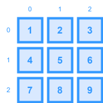

# Matrix



A `matrix` is a two-dimensional collection of values organized in rows and columns. In coding interviews, matrices are used to model grids (chess boards, maps, game levels), images (pixel data), or even state spaces in dynamic programming challenges.

Matrices often require you to:

- Traverse the grid in various orders (row‑major, column‑major, diagonally, or in a spiral).
- Apply transformations like rotation or transposition.
- Search for elements or compute cumulative sums in submatrices.
___

## Representation

In most languages, a `matrix` is represented as an array of arrays. For example, a 3x3 `matrix` of numbers can be represented as:
```ts
const matrix: number[][] = [
  [1, 2, 3],
  [4, 5, 6],
  [7, 8, 9],
];
```

This structure means that `matrix[i]` accesses the i‑th row, and `matrix[i][j]` accesses the element in the i‑th row and j‑th column.
___

## Time/Space Complexity

Most operations, such as full traversals, are $O(n \times m)$ where $n$ is the number of `rows` and $m$ is the number of `columns`. In-place operations (like rotating a matrix) should keep extra space usage minimal.
___

## Edge Cases
### Empty Matrix

Ensure your code handles a matrix with no rows or no columns.

### Non-Rectangular Matrix

Although most interview problems use rectangular matrices (same number of columns per row), ensure your design assumes uniformity unless stated otherwise.

### Index Out-of-Bounds

Always validate that the provided row and column indices are within the matrix bounds.

### Single Row/Column

Special handling might be required when the matrix contains only a single row or a single column, especially in traversal or rotation problems.

### Obstacles or Special Values

Problems such as “Number of Islands” may designate special values (e.g., 0 for water, 1 for land). Be sure to consider how these affect iteration and traversal.
___

## Basic Traversal

Many problems require simple traversal (e.g., summing elements, finding maximum/minimum values).

There are many different traversal methods for matrices & multidimensional arrays, but the two most common methods are `row-major` & `column-major` traversal.

* `row-major`: Where the row is the least frequently updated value: `[0,0] [0,1] [0,2] [1,0] [1,1] [1,2]`...
    * **Traversal**: Outer loop iterates over `rows`, inner loop iterates over `columns`.
* `column-major`: Where the column is the least frequently updated value: `[0,0] [1,0] [2,0] [0,1] [1,1] [2,1]`...
    * **Traversal**: Outer loop iterates over `columns`, inner loop iterates over `rows`.


### Row Major
Here's how you can traverse a matrix in `row‑major` order:

```ts
function traverseMatrix(matrix: number[][]): void {
  for (let i = 0; i < matrix.length; i++) {
    for (let j = 0; j < matrix[i].length; j++) {
      console.log(`Element at [${i}][${j}]: ${matrix[i][j]}`);
    }
  }
}
```

### Column Major
Here's how you can traverse a matrix in `column‑major` order:

```ts
function traverseMatrix(matrix: number[][]): void {
  for (let j = 0; j < matrix[0].length; j++) {
    for (let i = 0; i < matrix.length; i++) {
      console.log(matrix[i][j]);
    }
  }
}
```
___

## Dynamic Programming on Matrices

Many dynamic programming problems operate on grids:

- **Unique Paths:** Count the number of unique paths from the top-left to the bottom-right in a grid.
- **Minimum Path Sum:** Find a path that minimizes the sum of numbers along the route.
- **Longest Increasing Path:** A more advanced problem that involves memoization across matrix cells.

Each of these problems leverages the fundamental ability to access and update matrix cells, so a solid understanding of matrix traversal and boundary management is key.

___


## LeetCode Questions

- **Search a 2D Matrix**
    - **Link:** [LeetCode 74](https://leetcode.com/problems/search-a-2d-matrix/)
    - **Prerequisites:** Basic binary search and array manipulation.

- **Spiral Matrix**
    - **Link:** [LeetCode 54](https://leetcode.com/problems/spiral-matrix/)
    - **Prerequisites:** Array traversal and simulation of loop boundaries.

- **Number of Islands**
    - **Link:** [LeetCode 200](https://leetcode.com/problems/number-of-islands/)
    - **Prerequisites:** Depth-first search (DFS) or breadth-first search (BFS) combined with grid traversal.

- **Word Search**
    - **Link:** [LeetCode 79](https://leetcode.com/problems/word-search/)
    - **Prerequisites:** DFS/backtracking and managing visited cells in a grid.

- **Unique Paths**
    - **Link:** [LeetCode 62](https://leetcode.com/problems/unique-paths/)
    - **Prerequisites:** Dynamic programming and handling multi-dimensional DP tables.

- **Game of Life**
    - **Link:** [LeetCode 289](https://leetcode.com/problems/game-of-life/)
    - **Prerequisites:** Simulation of grid state changes and imitating neighbor cell rules in matrices.
