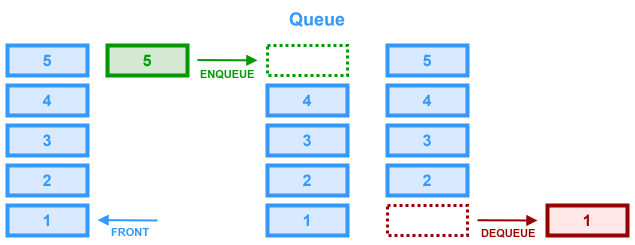

# Queue



A `queue` is an abstract data structure that functions a lot like a line at a ticket stand. It is a linear collection of elements that are maintained in a sequence. Queues implement `FIFO` (First-in First-out) ordering. This means that the first element added (enqueued) is the first one to be removed (dequeued). This behavior closely resembles waiting in line: the first person to join the line is the first one served.
___

## Queue Operations

* `enqueue(item)` - Add an element to the `back` of the queue.
* `dequeue()` - Remove and return the item at the `front` of the queue.
* `front()/peek()` - Return the item at the `front` of the queue.
* `isEmpty()` - Returns true if **and only if** the queue is empty.
___

## Time/Space Complexity

### Time Complexity
- **Front/Peek**: $O(1)$
- **Enqueue**: $O(1)$
- **Dequeue**: $O(1)$
- **isEmpty**: $O(1)$
- **Search**: $O(n)$ (If you need to search for an element that isn’t at the very front.)

### Space Complexity

$O(n)$ - Where $n$ is the number of elements stored in the queue.

> **NOTE**: When implementing with a plain array and using methods like `shift()`, there might be a hidden $O(n)$ cost due to reindexing. Utilizing a `circular buffer` or a `linked list` avoids this pitfall.

___

## Edge Cases
### Empty Queue Operations

Dequeuing or peeking when the queue is empty should be handled gracefully (e.g., by returning undefined or throwing an appropriate error).

### Queue Overflow

If implementing a fixed-size (bounded) array-based queue, ensure you properly handle the situation when the queue is full.

### Memory Management (Linked List Implementation)

When using a linked list, be cautious when removing nodes—ensure that head/tail pointers are updated correctly to avoid memory leaks.

### Circular Buffer Implementation Pitfalls

When using a circular array, correctly manage the wrap-around with modulo arithmetic to prevent index errors.
___

## When to Use a Queue

### Breadth-First Search (BFS)

Traversing trees or graphs level by level.

### Scheduling and Task Processing

Managing jobs in order (e.g., print queues, CPU scheduling).

### Real-Time Data Streaming

Buffering data received asynchronously (e.g., message queues).

### Sliding Window Problems

Maintaining a window of elements while processing sequences.

### Simulation Problems

Modeling systems like customer service or traffic lights where the order of events matters.

___

## Example Implementations


Just like with the `stack` data structure, a `queue` can be implemented using an `array` or `linked list`.

### Linked-List-Based Implementation

```ts
// Nest this in the Queue class when the language allows it
class QueueNode<T> {
  public data: T;
  public next: QueueNode<T>;

  constructor(data: T, next: QueueNode<T> | null = null) {
    this.data = data;
    this.next = next;
  } 
}

class MyQueue<T> {

  private front: QueueNode<T> | null = null;
  private back: QueueNode<T> | null = null;

  enqueue(item: T): void {
    const node = new QueueNode<T>(item);
    if (this.back !== null) {
      this.back.next = node;
    }
    this.back = node;
    if (this.front === null) {
      this.front = node;
    }
  }

  dequeue(): T | undefined {
    if (this.front === null) {
      return undefined;
    }
    const data = this.front.data;
    this.front = this.front.next;
    if (this.front === null) {
      this.back = null;
    }
    return data;
  }

  peek(): T | undefined {
    if (this.front === null) {
      return undefined;
    }
    return this.front.data;
  }

  isEmpty(): boolean {
    return this.front === null;
  }
}
```

### Array-Based Implementation
```ts
class Queue<T> {
  private items: T[];

  constructor() {
    this.items = [];
  }

  // Enqueue: add an element to the back
  enqueue(item: T): void {
    this.items.push(item);
  }

  // Dequeue: remove an element from the front
  dequeue(): T | undefined {
    return this.items.shift();
  }

  // Peek: view the element at the front without removing it
  peek(): T | undefined {
    return this.items[0];
  }

  // Check if the queue is empty
  isEmpty(): boolean {
    return this.items.length === 0;
  }

  // Return the number of elements in the queue
  size(): number {
    return this.items.length;
  }
}

```

### Using the Built-In Array Type

In TypeScript/JavaScript, the built in `array` data type already has built-in functions that handle `queue` operations. For most interview/code assessment questions (where you're using JavaScript/TypeScript) it's best to just create an array and use the built-in methods.

- **shift**: Same as the `dequeue` method
- **push**: Same as the `enqueue` method

___

## LeetCode Questions

- **Binary Tree Level Order Traversal**
    - **Focus**: Use a queue to perform a level-order (BFS) traversal on a tree.
    - **Prerequisites**: Basic tree structure and BFS.

- **Course Schedule** and **Course Schedule II**
    - **Focus**: These problems involve applying BFS (using a queue) for topological sorting in directed acyclic graphs (DAGs).
    - **Prerequisites**: Understanding of graphs and basic topological sort.

- **Rotting Oranges**
    - **Focus**: Use multi-source BFS with a queue to simulate time steps in grid-based problems.
    - **Prerequisites**: Grid traversal and BFS.

- **Number of Islands** (BFS/DFS)
    - **Focus**: While more commonly solved with DFS, a BFS approach using a queue is entirely applicable.
    - **Prerequisites**: Grid traversal and basic graph search algorithms.

- **Open the Lock**
    - **Focus**: Use BFS with a queue to traverse states in a combinatorial problem.
    - **Prerequisites**: Basic BFS and understanding state space exploration.
