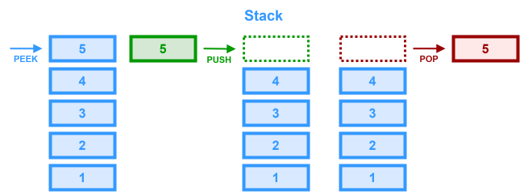

# Stack



A `stack` is an abstract data structure that functions much like a stack of dinner plates. It is essentially a list in which items are added to and removed from the end of the list. Stacks can be implemented using an `array` or a `linked list`.

Stacks utilize `LIFO` or (**L**ast-**i**n **F**irst-**o**ut) ordering. This means that the most recent item added is the first item to be removed. The name "stack" for this type of structure comes from the analogy to a set of physical items stacked on top of each other.

Stacks are an important way of supporting nested or recursive function calls and is used to implement depth-first search.
___

## Stack Operations
* `pop()` - Removes the top (last) item from the stack
* `push(item)` - Adds a new item to the top (end) of the stack
* `peek()` - Returns the element at the top of the stack
* `isEmpty()` - Returns true if **and only if** the stack is empty
___

## Time/Space Complexity

### Time Complexity
- **Peek**: $O(1)$
- **Push**: $O(1)$
- **Pop**: $O(1)$
- **isEmpty**: $O(1)$
- **Search**: $O(n)$

### Space Complexity

$O(n)$ overall, as stack implementation will require space proportional to the number of elements stored.
___

## Edge Cases

### Empty Stack Operations

Underflow: Attempting to pop or peek when the stack is empty. Always check (or handle exceptions) to avoid unexpected behavior.

### Fixed-Size Limitations

If you implement a stack using a fixed-size array, pushing an element when the stack is full might cause overflow. Dynamic arrays or linked list implementations can mitigate this issue.

### Stack Overflow in Recursion

Although not part of the manual stack implementation, the call stack used for recursion can overflow if the recursion is too deep.

### Data Integrity

When using the stack in multi-threaded environments, ensure that proper synchronization is applied to avoid race conditions.

___

## When to Use

Stacks are best used in scenarios where problems exhibit a reversed order of operations or where the most recent operation needs to be undone first.

### Expression Evaluation

Converting infix expressions to postfix notation and evaluating them.

### Balanced Parentheses / Valid Brackets

Checking for the correct matching of parentheses, braces, or brackets in a string.

### Backtracking Problems

Problems like maze solving, where you store state information that might need to be revisited.

### Depth-First Search (DFS)

Implementing DFS either explicitly (with a stack) or implicitly (via recursion, which uses the call stack).

### Undo/Redo Operations

Many applications, such as text editors, use stacks to keep track of user actions.

___

## Example Implementations

Stacks can be implemented using either an array or a linked list to store items. There are tradeoffs for using one or the other.

### Linked-List-Based Implementation
* **Pros**
    * Dynamically resizes without needing an initial capacity
    * No need to manage resizing logic
* **Cons**
    * Requires additional memory for storing pointers
    * Slightly more complex pointer manipulation

```ts
class MyStack<T> {
  private top: MyStack.StackNode<T> | null = null;

  public pop(): T | null {
    if (this.top === null) {
      return null;
    }
    const data: T = this.top.data;
    this.top = this.top.next;
    return data;
  }

  public push(item: T): void {
    this.top = new MyStack.StackNode<T>(item, this.top);
  }

  public peek(): T  | null {
    return this.top.data;
  }
  
  public isEmpty(): boolean {
    return this.top === null;
  }

}

// In Java, we would just nest the classes, but in TypeScript we need to do this.
namespace MyStack {
  export class StackNode<T> {
    public data : T;
    public next : StackNode<T> | null;

    constructor(data: T, next: StackNode<T> | null = null) {
      this.data = data;
      this.next = next;
    }
  }
}
```

### Array-Based Implementation
* **Pros**
    * Simple to implement
    * Constant time, $O(1)$, for push and pop operations if the array has pre-allocated capacity or is using dynamic resizing
* **Cons**
    * May need to resize when capacity is exceeded (in dynamic arrays)
    * Fixed-size arrays in some languages can lead to overflow if the maximum capacity is reached
```ts
class MyStack<T> {
  private items: T[];

  constructor() {
    this.items = [];
  }

  pop(): T | undefined {
    return this.items.pop();
  }

  push(item: T): void {
    this.items.push(item);
  }

  peek(): T | undefined {
    return this.items[this.items.length - 1];
  }

  isEmpty(): boolean {
    return this.items.length === 0;
  }
}
```

### Using the Built-In Array Type

In TypeScript/JavaScript, the built in `array` data type already has built-in functions that handle `stack` operations. For most interview/code assessment questions (where you're using JavaScript/TypeScript) it's best to just create an array and use the built-in methods.

- **pop**: Same as the `stack` pop method
- **push**: Same as the `stack` push method

___

## LeetCode Questions

- **[Valid Parentheses (#20)](https://leetcode.com/problems/valid-parentheses/)**
    - **Scenario:** Check if an input string has valid matching parentheses.
    - **Dependencies:** Basic string manipulation; no advanced data structures needed.

- **[Min Stack (#155)](https://leetcode.com/problems/min-stack/)**
    - **Scenario:** Design a stack that supports retrieving the minimum element in constant time.
    - **Dependencies:** May require a secondary stack or additional logic to keep track of the current minimum; rely on fundamental stack operations.

- **[Evaluate Reverse Polish Notation (#150)](https://leetcode.com/problems/evaluate-reverse-polish-notation/)**
    - **Scenario:** Evaluate an arithmetic expression in reverse polish notation.
    - **Dependencies:** Basic arithmetic operations and string manipulation.

- **[Decode String (#394)](https://leetcode.com/problems/decode-string/)**
    - **Scenario:** Decode strings with nested patterns (e.g., "3[a2[c]]" => "accaccacc").
    - **Dependencies:** String manipulation plus the use of one or two stacks to manage counts and accumulated strings.

- **[Simplify Path (#71)](https://leetcode.com/problems/simplify-path/)**
    - **Scenario:** Simplify a Unix-style file path using a stack for directory names.
    - **Dependencies:** String splitting and manipulation combined with stack usage.