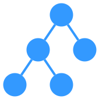
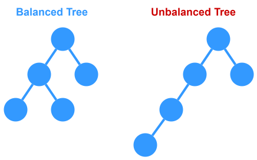
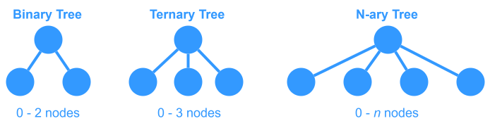
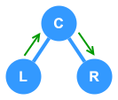
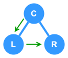
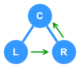

# Tree



A `tree` is a hierarchical, non-linear data structure made up of `nodes`. Each node contains a value (or data) and references (or pointers) to its child nodes.

Trees are `acyclic`, meaning they cannot contain cycles. There is no way to start at one node and return to it by following its child nodes. Nodes may or may not be in order, they could have any data type as values, and they may or may not have pointers to their `parent` nodes.

Each node can be represented as the `root` node of its own `subtree`, making **recursion** a useful technique for tree traversal.

Trees are commonly used to represent hierarchical data, e.g. file systems, JSON, and HTML documents.

### Node Definition

A `node` of a `tree` must have the following:
- **key** - Defines the `node`
- **children** - List of child nodes (or none)
- **parent** - (optional) Reference to the `parent` node
___

## Term Definitions

- `root` - The topmost node of a tree (the only node without a `parent` node).
- `parent` - For any node $n$, the `parent` node is the connected node _above_ node $n$.
- `child` - For any node $n$, the `child` node is the connected node _below_ node $n$.
- `sibbling`/`neighbor` - Two or more nodes that share the same `parent` node
- `size`/`degree` - For any node $n$, it's `size` is the number of nodes in the child hierarchy of node $n$.
- `leaf` - A node of a `tree` that has no `child` nodes.
- `interior` - Any node that _does_ have `child` nodes (not a `leaf` node).
- `edge` - Connection between a `parent` and `child` node.
- `ancestor` - For any node $n$, an `ancestor` is any node that is a `parent` of node $n$.
- `descendant` - For any node $n$, a `descendant` is any node that is within the `child` hierarchy of node $n$.
- `level`/`depth` - For any node $n$, it's `level` is calculated as 1 + the number of `edges` between node $n$ and the `root` node.
- `height` - For any node $n$, it's `height` is calculated as $n$'s _deepest_ child node's `level` relative to $n$ (as if $n$ were the root of the `tree`).
- `width` - The total number of nodes on a single `level` of a `tree`.
- `distance` - The number of `edges` along the _shortest_ path between two nodes.
- `forest` - A collection of `trees`.
___

## Time/Space Complexity

The complexities depend on the type of tree and whether it’s balanced.

### For a Balanced Binary Search Tree (BST):
- **Search:** $O(\log(n))$ on average
- **Insertion:** $O(\log(n))$ on average
- **Deletion:** $O(\log(n))$ on average
- **Space Complexity:** $O(n)$ for storing n nodes

### For a General (Unordered) Tree or Degenerate Tree:
- **Search:** $O(n)$ in the worst case (if the tree becomes a “linked list” due to degenerate insertions)
- **Insertion:** $O(1)$ if you already have a pointer to the parent; $O(n)$ if you must search for a location
- **Deletion:** Varies based on re-linking children (can be $O(n)$ in the worst case)
- **Space Complexity:** $O(n)$

**Traversal operations** (preorder, inorder, postorder, level order) require $O(n)$ time since every node must be visited, and the space complexity can be $O(n)$ in the worst case for storing nodes in auxiliary data structures (such as a queue for level order or a stack for DFS in skewed trees).
___

## Implementation

A very simple class definition for a tree node is:

```ts
class Node {
  public value: number;
  public children: Node[];
}
```
___

## Edge Cases

### Empty Tree
Ensure your functions gracefully handle a tree with no nodes.

### Single Node
The tree that only consists of the root should still work correctly.

### Degenerate (Skewed) Trees
These are trees where each parent has only one child (left or right), resulting in a structure similar to a linked list. This may cause operations that are usually O(log n) in balanced trees to degrade to O(n).

### Handling Duplicate Values
Decide whether your tree will allow duplicates. For BSTs, you need a clear policy (e.g., always insert duplicates to the right).

### Tree Cycles (Bug Prevention)
Although trees are acyclic by definition, bugs in pointer logic might accidentally introduce cycles. It’s good practice to have checks in recursive functions (or use visited sets in traversal) when unsure.

### Deletion Cases (in BSTs)
* **Leaf Deletion**: Simply remove the leaf.
* **Single Child**: Replace the node with its only child.
* **Two Children**: Typically, replace the node with its inorder successor (smallest in the right subtree) or predecessor.
___

## Common Operations

* Insert value
* Delete value
* Count number of nodes in tree
* Whether a value is in the tree
* Calculate height of the tree
* Binary search tree
    * Determine if it is a binary search tree
    * Get maximum value
    * Get minimum value
___

## Balanced vs. Unbalanced

A `balanced` tree is a tree in which the tree's structure is optimized such that the `subtrees` of any given node do not differ  in `height` by more than a small constant (usually 1).

In contrast, an `unbalanced` tree is one where this difference can become large, potentially leading to a structure that resembles a linked list in the worst case.


___

## Types of Trees

There are three general types of `trees`: **binary trees**, **ternary trees** and **N-ary trees**.



- **Binary Trees**: Each node has at most 2 `child` nodes
- **Ternary Trees**: Each node has at most 3 `child` nodes
- **N-ary Trees**: Each node has at most $n$ `child` nodes

For the most part, interview questions will deal with types of `binary trees`, as those are the most useful in terms of algorithms and problem-solving.
___

## Binary Trees

A `binary tree` is defined as a tree in which each `node` has at most 2 child nodes.

### Binary Tree Implementation

The class declaration for a `binary tree` is typically set up as:
```ts
class BinaryTreeNode {
  public value: number;
  public left: BinaryTreeNode;
  public right: BinaryTreeNode;
  //(optional)
  public parent: BinaryTreeNode;
}
```

### Binary Search Tree (BST)

A `binary search tree` (BST) is a `binary tree` in which every node fits a specific ordering property: all left descendants <= $n$ <= all right descendants.


> **NOTE:** The definition of a binary search tree can vary slightly with respect to equality. Under some definitions, the tree cannot have duplicate values. In others, the duplicate values will be on the right or can be on either side. All are valid definitions.

#### Time/Space Complexity

Balanced `binary search trees` offer an average case time complexity of `O(log n)` for most operations, with a worst case scenario for unbalanced trees being `O(n)`.

The space complexity for `binary search trees` is `O(n)` as each node needs to be stored in memory.

> **NOTE:** When a question involves a BST, the interviewer is usually looking for a solution which runs faster than `O(n)`.

### Complete Binary Tree

A `complete binary tree` is a special type of `binary tree` where all the levels of the tree are filled completely except (possibly) the lowest level nodes which are filled from _left to right_ starting at the **leftmost** node.


### Full Binary Tree

A `full binary tree` is a `binary tree` in which every node has either zero or two children. That is, no nodes have only one child.


### Perfect Binary Tree

A `perfect binary tree` is a `binary tree` where all `interior` nodes have two children and all `leaf` nodes are at the same level.


### Binary Tree Traversal

There are three common traversal patterns for `binary trees`: in-order, pre-order and post-order.

#### In-Order Traversal



In-order traversal means to "visit" (often print) the left branch, then the current node, and finally, the right branch.

```ts
function inOrderTraversal(node: TreeNode): void {
  if (node != null) {
    inOrderTraversal(node.left);
    visit(node);
    inOrderTraversal(node.right);
  }
}
```

#### Pre-Order Traversal



Pre-order traversal visits the current node before its child nodes, which are visited from left to right.

```ts
function preOrderTraversal(node: TreeNode): void {
  if (node != null) {
    visit(node);
    preOrderTraversal(node.left);
    preOrderTraversal(node.right);
  }
}
```

#### Post-Order Traversal



Post-order traversal visits the current node after both of its child nodes have been visited (from left to right).

```ts
function postOrderTraversal(node: TreeNode): void {
  if (node != null) {
    postOrderTraversal(node.left);
    postOrderTraversal(node.right);
    visit(node);
  }
}
```
___

## LeetCode Questions

- **Binary Tree Inorder Traversal (LeetCode #94):**  
  - **Topics Covered:** Tree traversal, recursion.  
  - **Prerequisites:** Basic recursion and familiarity with tree nodes.

- **Binary Tree Level Order Traversal (LeetCode #102):**  
  - **Topics Covered:** Breadth-first search (BFS) via queues.  
  - **Prerequisites:** Understanding of trees and use of auxiliary data structures like queues.

- **Validate Binary Search Tree (LeetCode #98):**  
  - **Topics Covered:** Tree traversal, BST properties.  
  - **Prerequisites:** Inorder traversal and understanding the BST invariant.

- **Symmetric Tree (LeetCode #101):**  
  - **Topics Covered:** Recursion, tree mirroring.  
  - **Prerequisites:** Basic tree traversal and recursion.

- **Maximum Depth of Binary Tree (LeetCode #104):**  
  - **Topics Covered:** Recursive tree traversal to determine depth.  
  - **Prerequisites:** Recursion and understanding tree height.

- **Lowest Common Ancestor of a Binary Tree (LeetCode #236):**  
  - **Topics Covered:** Recursion, divide and conquer in trees.  
  - **Prerequisites:** Solid grasp of DFS, recursion, and tree structure.

- **Serialize and Deserialize Binary Tree (LeetCode #297):**  
  - **Topics Covered:** Tree traversal, string manipulation, recursion.  
  - **Prerequisites:** Familiarity with tree traversal patterns (BFS/DFS) and handling edge cases.

> **NOTE:** Some of these questions might require knowledge of additional algorithms (like DFS/BFS) or data structures (such as queues for level order traversal). If you haven't studied these yet, it might be useful to cover those topics in parallel.