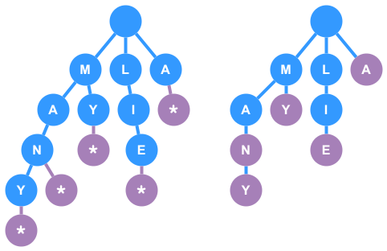

# Tries

A `trie` (pronounced “try”), also known as a `prefix tree` or `digital search tree`, is a tree-like data structure that is primarily used to store and retrieve keys in a dataset of strings or other data types. It is a variant of an `N-ary` tree in which each node represents a single character of a key. The `root` node represents an empty string, and every path from the `root` to a `leaf` (or to a `null node`) represents a valid word or complete key in the trie.

Tries can be used to hold any sequence of symbols, not just words (bits, ASCII, etc.).

### Key Characteristics
- **Prefix Sharing:** Common prefixes are stored only once. For example, the words `cat`, `car`, and `cart` share the prefix “ca.”
- **Terminal Nodes:** Nodes that represent the end of a valid word (sometimes referred to as `terminal nodes` or `null nodes`) can be represented by either a **boolean** (e.g., `isEndOfWord`) on the node or a **special child node**.
- **Child Mapping:** Each node maintains a collection (or map) from characters to child nodes. This collection can be implemented as a hash map, an array (if using a fixed character set), or even a tree in some cases.
___

## **Common Operations**

In most cases, whether using class wrapper for the trie or just using a class for the node and floating functions for operations, an implementation of a trie will have the following operations:

- **Create**: The act of creating a new trie or a new node in the trie
- **Insert**: Inserts a new _word_ into the trie, making sure to properly handle existing characters and prefixes
- **Search**: Searching for a complete and valid _word_ in the trie
- **Delete**: Deletes a _word_ from the trie

The following operations are less frequent, but can be helpful in trie implementations under certain circumstances:
- **Starts With**: Checks if there is any word in the trie that starts with the given prefix
- **Print**: Prints all the nodes currently in the trie
___

## Time/Space Complexity

For a trie storing words of average length $m$ and with $n$ total words:

- **Insertion:**  
  **Time:** $O(m)$ per word  
  **Space:** $O(m)$ additional space per word in the worst case (when no prefixes are shared)

- **Search:**  
  **Time:** $O(m)$ per query (where $m$ is the length of the query word or prefix)

- **Deletion:**  
  **Time:** $O(m)$ per word if implemented properly, with additional time to clean up unused nodes  
  **Space:** No extra space beyond the recursion stack

**Average-case Space Complexity for the Entire Trie:**  
Approximately $O(n \times m)$ in the worst-case (if all words do not share any prefixes). However, in practice, shared prefixes reduce the space used considerably.

It's good to keep record of state when looking things up and have calls build on each other to reduce the number of lookups.
* **Example**: When looking for the word "MANY", instead of searching: M, M->A, M->A->N, M->A->N->Y -- you would store the state of your last search by passing around a reference to the last visited node in the tree.
    * In this example, you would return the node to the caller function so it can start from that node on the next search
___

## Edge Cases

### **Empty String:**  
  Decide how to handle insertion and search for an empty string. Typically, you can either treat it as invalid or consider the root as representing the empty string.

### **Duplicate Words:**  
  If the same word is inserted multiple times, decide whether to maintain a count or simply ignore duplicates.

### **Deletion:**  
  Removing a word from the trie must be handled carefully. You must ensure that only those nodes that are no longer a prefix for any other word are removed. For example, deleting `car` when `card` is also in the trie should not remove nodes needed by `card`.

### **Non-Alphabet Characters / Unicode:**  
  If your trie should support characters beyond a simple a–z (or a fixed range), ensure your child mapping structure (e.g., a hash map) scales accordingly.
___

## When to Use a Trie

### **Autocomplete Systems:**  
  Quickly retrieving all words that start with a given prefix.

### **Spell Checkers:**  
  Determining whether a word exists or finding suggestions based on mistyped prefixes.

### **Longest Prefix Matching:**  
  For applications such as IP routing or text processing.

### **Word Search Problems:**  
  Especially when you need to verify the presence of words in puzzles (e.g., Boggle, Word Search II).

### **Designing Dictionaries:**  
  Frequently used in interview questions that require designing a data structure for fast insertion and retrieval of strings.

### **Word Validation**  
  Be on the lookout for the word 'validation' in the context of words, as that often means a `trie` is best.
___

## **LeetCode Questions**

- **208. Implement Trie (Prefix Tree)**
    - **What You’ll Practice:**  
      Basic trie implementation (insert, search, startsWith)
    - **Prerequisites:**  
      Familiarity with trees and hash maps.

- **211. Design Add and Search Words Data Structure**
    - **What You’ll Practice:**  
      Extending trie search to handle wildcards (e.g., the `.` character)
    - **Prerequisites:**  
      Trie implementation, recursion, and possibly backtracking.

- **212. Word Search II**
    - **What You’ll Practice:**  
      Using a trie to efficiently find multiple words in a board (coupled with DFS).
    - **Prerequisites:**  
      Trie, depth-first search, and handling grid-based traversal.

- **425. Word Squares** (if available) or similar problems where prefix lookups are crucial.
    - **What You’ll Practice:**  
      Constructing word squares based on common prefixes.
    - **Prerequisites:**  
      Trie, iterative or recursive backtracking.

---