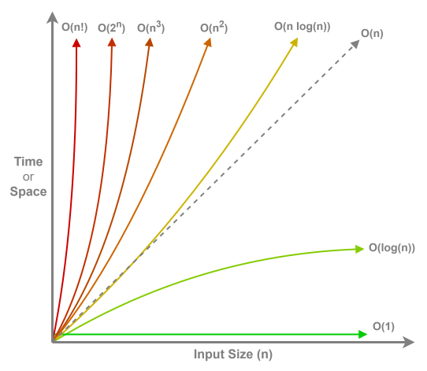

# Big-O Notation



**Big O Notation**, or asymptotic runtime, is a mathematical representation used to describe the **upper bound** of an algorithm's running time or space requirements in terms of the input size, denoted as $n$. 

It provides a high-level understanding of how an algorithm's performance scales **as the input size grows**, abstracting away constants and lower-order terms to focus on the most significant factors affecting efficiency.

### Key Points

- **Abstraction:** It ignores constant factors and less significant terms to focus on growth rates.
- **Worst-Case Scenario:** Typically describes the worst-case performance, ensuring limits on resource usage.
- **Comparison Tool:** Facilitates the comparison of different algorithms irrespective of hardware or implementation specifics.

### Why It Matters

Understanding **Big O Notation** is crucial for technical interviews, especially when tackling algorithm and data structure problems. It helps both you and the interviewer assess the efficiency and scalability of your solutions. Let’s delve into what Big O Notation is, why it matters, and how to effectively apply it during your interview preparation and problem-solving.

___

## Time Complexity vs. Space Complexity

### Time Complexity

Measures how the runtime of an algorithm increases with the input size. For example, a linear time algorithm ($O(n)$) will perform roughly twice as many operations if the input size doubles.

### Space Complexity

Measures the amount of memory (space) an algorithm uses in relation to the input size. Even if an algorithm is very fast, it can be impractical if it requires too much memory.

> **Example:** A function that performs a constant number of operations regardless of input has $O(1)$ time complexity (constant time), but if it needs to allocate an array proportional to the size of the input, its space complexity is $O(n)$.

> **NOTE**: Algorithm design is often a tradeoff between **time** and **space**. You have to make a decision on which to prioritize based on the context of the situation.

______

## Common Big O Complexities

Here are some common Big O classes, ordered from the most efficient to the least efficient:


1. $O(1)$ – Constant Time
    - **Definition:** Execution time remains constant regardless of input size.
    - **Example:** Accessing an element in an array by index.
    - **Use Case:** Retrieving data from a fixed position.

2. $O(\log(n))$ – Logarithmic Time
    - **Definition:** Execution time grows logarithmically with input size.
    - **Example:** Binary search in a sorted array.
    - **Use Case:** Efficient searching in large datasets.

3. $O(n)$ – Linear Time
    - **Definition:** Execution time grows linearly with input size.
    - **Example:** Iterating through all elements in a list.
    - **Use Case:** Simple loops and single-pass algorithms.

4. $O(n \log(n))$ – Linearithmic Time
    - **Definition:** Execution time grows proportionally to $n \times \log(n)$.
    - **Example:** Efficient sorting algorithms like Merge Sort and Quick Sort.
    - **Use Case:** Sorting large datasets efficiently.

5. $O(n^2)$ – Quadratic Time
    - **Definition:** Execution time grows proportionally to the square of the input size.
    - **Example:** Bubble Sort, Selection Sort.
    - **Use Case:** Simple, brute-force algorithms on small datasets.

6. $O(2^n)$ – Exponential Time
    - **Definition:** Execution time doubles with each additional input element.
    - **Example:** Solving the Traveling Salesman Problem using brute-force.
    - **Use Case:** Problems that require exploring all subsets, often impractical for large $n$.

7. $O(n!)$ – Factorial Time
    - **Definition:** Execution time grows factorially with input size.
    - **Example:** Generating all permutations of a set.
    - **Use Case:** Highly impractical for even modest input sizes.

## Best Case, Worst Case, and Average Case

When analyzing the **time/space complexity** of an algorithm, we are usually talking in terms of the **worst case** scenario, but other cases may be noted as well if the situation calls for it.

- **Best Case**: The scenario where the algorithm performs the minimum number of operations. This is rarely calculated as it isn't very helpful in assessing the efficiency of an algorithm.
- **Worst Case**: The scenario where the algorithm performs the maximum number of operations. Most displayed runtimes are based off of the **worst case**.
- **Average Case**: Also known as the "expected" case, refers to the average runtime across all input cases (usually calculated with assumptions about input distribution).

### Amortized Time

Amortized analysis is used when an expensive operation happens rarely, so that while one operation may take a long time, the average cost per operation (over a sequence of operations) is low.

For example, when using a dynamic array (like JavaScript’s built-in `array` or Java's `ArrayList`), most insertions are $O(1)$. However, when the internal array is full, it must be resized (copied over to a new array), which is $O(n)$. Over many insertions, the average time per insertion remains $O(1)$ because the expensive resizing happens infrequently.

___

## Code Examples


### $O(1)$ – Constant Time
```ts
function getLastElement<T>(arr: T[]): T | undefined {
  // Directly access the last element (constant-time operation)
  return arr[arr.length - 1];
}
```

### $O(log n)$ – Logarithmic Time
```ts
function binarySearch(arr: number[], target: number): number {
  let left = 0;
  let right = arr.length - 1;
  while (left <= right) {
    const mid = Math.floor((left + right) / 2);
    if (arr[mid] === target) return mid;
    else if (arr[mid] < target) left = mid + 1;
    else right = mid - 1;
  }
  return -1; // Target not found
}
```

### $O(n)$ – Linear Time
```ts
function linearSearch(arr: number[], target: number): number {
  for (let i = 0; i < arr.length; i++) {
    if (arr[i] === target) return i;
  }
  return -1; // Target not found
}
```

### $O(n \log(n))$ – Log-Linear Time (Merge Sort)
```ts
function mergeSort(arr: number[]): number[] {
  if (arr.length <= 1) return arr;
  
  const mid = Math.floor(arr.length / 2);
  const left = mergeSort(arr.slice(0, mid));
  const right = mergeSort(arr.slice(mid));
  
  return merge(left, right);
}

function merge(left: number[], right: number[]): number[] {
  const result: number[] = [];
  while (left.length && right.length) {
    if (left[0] < right[0]) result.push(left.shift()!);
    else result.push(right.shift()!);
  }
  return result.concat(left, right);
}
```

### $O(n \times m)$ - Independent Inputs
```ts
// Get every pair of elements from two arrays
let [nums1, nums2] = [[1,2,3], [4,5]];
for (let i = 0; i < nums1.length; i++) {
    for (let j = 0; j < nums2.length; j++) {
        print(nums1[i], nums2[j]);
    }
}

// Travers a rectangle grid (3x2, 3x5, etc.)
let nums = [[1,2,3], [4,5,6]];
for (let i = 0; i < nums.length; i++) {
    for (let j = 0; j < nums[i].length; j++) {
        print(nums[i][j]);
    }
}
```


### $O(n^2)$ – Quadratic Time
```ts
function findPairsWithSum(arr: number[], sum: number): [number, number][] {
  const results: [number, number][] = [];
  for (let i = 0; i < arr.length; i++) {
    for (let j = i + 1; j < arr.length; j++) {
      if (arr[i] + arr[j] === sum) {
        results.push([arr[i], arr[j]]);
      }
    }
  }
  return results;
}
```

### $O(n^3)$ – Cubic Time
```ts
function tripleNestedLoop(arr: number[]): number {
  let count = 0;
  for (let i = 0; i < arr.length; i++) {
    for (let j = 0; j < arr.length; j++) {
      for (let k = 0; k < arr.length; k++) {
        // Perform constant-time work inside the innermost loop
        count++;
      }
    }
  }
  return count;
}
```

### $O(2^n)$ – Exponential Time
```ts
function exponentialFib(n: number): number {
  // This naive recursive implementation computes Fibonacci numbers in O(2^n) time.
  if (n <= 1) return n;
  return exponentialFib(n - 1) + exponentialFib(n - 2);
}
```

### $O(n!)$ – Factorial Time (Permutations)
```ts
function getPermutations<T>(arr: T[]): T[][] {
  if (arr.length === 0) return [[]];
  const result: T[][] = [];
  
  for (let i = 0; i < arr.length; i++) {
    const current = arr[i];
    const remaining = arr.slice(0, i).concat(arr.slice(i + 1));
    const remainingPermutations = getPermutations(remaining);
    for (const perm of remainingPermutations) {
      result.push([current, ...perm]);
    }
  }
  
  return result;
}
```

___

## How to Analyze the Big O Complexity of an Algorithm

1. **Identify the Input Variable(s):**  
   - Determine what $n$ (or other variables) represent the size of your input.

2. **Examine Each Step:**
   - **Simple Statements:**  
     Constant-time operations (like arithmetic operations or assignments) are $O(1)$.
   - **Loops:**
      - A single loop over $n$ elements is $O(n)$.
      - Nested loops multiply their complexities (e.g., two nested loops are $O(n × n) = O(n^2)$).
   - **Recursive Calls:**  
     Analyze the recurrence relation (for example, $T(n) = 2T(n/2) + O(n)$ for `merge sort` yields $O(n \log(n))$).
   - **Function Calls:**  
     Consider the complexity of called functions if their cost isn’t $O(1)$.

3. **Combine the Steps:**
   - When operations are performed sequentially, add their complexities.  
     For instance, $O(n) + O(n)$ is still $O(n)$.
   - When operations are nested, multiply their complexities (e.g., $O(n)$ inside another $O(n)$ loop gives $O(n^2)$).

4. **Drop Constants and Lower Order Terms:**  
   - Big O notation abstracts away constants and less significant terms.  
   - For example, $O(3n + 2)$ is simplified to $O(n)$.

5. **Consider the Worst-Case Scenario (Unless Specified Otherwise):**  
   Interviewers generally expect the worst-case time complexity, though it’s good to be aware of best- and average-case analyses as well.

6. **Verify with Amortized Analysis if Needed:**  
   If an algorithm has occasional expensive operations (like resizing in dynamic arrays), determine the average cost per operation over many operations.