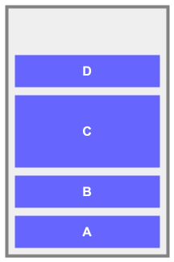
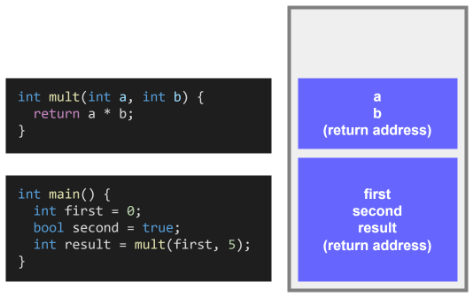

# Memory Management

The memory of an application is generally stored in three main parts: **machine code**, **stack** and **heap**.

Machine code is simply where an application is converted into a set of instructions that the computer can understand. The `stack` and the `heap` are part of _dynamically allocated_ memory and have different aspects and responsibilities

## The "Stack"

The `stack` in application memory functions much like the data structure. It uses a `LIFO` (Last-In First-Out) method of allocating memory. The `stack` is responsible for allocating memory for **function calls** and **local variables** and is designed to operate in the **local** scope. Memory allocated on the `stack` is automatically managed; when the functions finish executing, all the memory allocated for those functions is automatically released. There is a limited amount of space available on the `stack`, which is determined by the application at compile time.

The `stack` stores the following:
- **Function Call Frames**: Every time a function is called, a `stack frame` is created, which holds the function’s local variables, parameters, and return address.
- **Function Parameter**s: The parameters passed to a function are stored on the `stack`.
- **Local Variables**: Any variables declared within the scope of a function are also stored within it's `stack frame`.
- **Return Address**: The memory address to return to from the current function is also stored on the `stack`. 

These characteristics make the `stack` relatively fast compared to the `heap`, and make the `stack` and idea place to store memory for temporary, small, and predictable data (like numbers, pointers, and short-lived objects).

### Potential Issues

- **Stack Overflow**: Happens when the pre-allocated space for the `stack` is exceeded. This can happen due to extremely deep recursive calls or declaration of unreasonably large variables.

## The "Heap"

In application memory, the `heap` (no relation to the data structure) is where memory for **long-lived**, **globally-scoped** variables is allocated. The `heap` does not store memory in any order (like the `stack`) does. Memory is dynamically allocated and must be **manually** freed when corresponding objects are no longer in use. Allocating and freeing memory on the `heap` is generally **slower** than using the `stack` because it involves more complex management to find a free block of sufficient size. The `heap` is usually much larger than the `stack`, which is useful for applications that require a significant amount of dynamic memory.

Objects stored in the `heap` can be referenced within the _local_ scope of the `stack` using pointers. Variables can persist as long as needed; they remain in memory until explicitly freed (or automatically collected via a garbage collector). This makes the `heap` most suitable for large or complex objects whose size or lifetime may vary and need to be managed beyond the function’s scope.

The `heap` is used to allocate memory for the following:
- Global variables
- Class variables
- Reference Types
- Static variables
- C# anonymous functions
- Results for asynchronous methods

### Potential Issues

#### Memory Fragmentation

Unlike the `stack`’s contiguous block, the `heap` can become **fragmented** over time as memory allocations and deallocations occur, which may affect performance. 

In the early stages of a program, when unallocated space remains large and relatively contiguous, there is little overhead in allocating memory for an object. However, as more memory is allocated and freed, the unallocated space becomes divided up into various small chunks that look like "holes" between the allocated blocks. Eventually, allocation for an object will fail due to not having a sufficient contiguous chunk of unallocated space to assign it, even though the total unallocated memory is greater than the total memory needed for the object.

#### Memory Leaks

A **memory leak** occurs when memory for objects is allocated, but never freed up after they are no longer needed. This results in memory continuously being consumed until the program either runs out of memory, or has to page additional memory causing massive slowdowns in the application. This issue is generally not as prevalent in languages that us a `garbage collector` to automatically manage resources.

#### Dangling Pointers

When the memory address for an object that a pointer references is changed or freed and the pointer isn't updated, this results in a **dangling pointer**. This can lead to severe, difficult to debug issues when the application attempts to dereference that pointer after the fact.